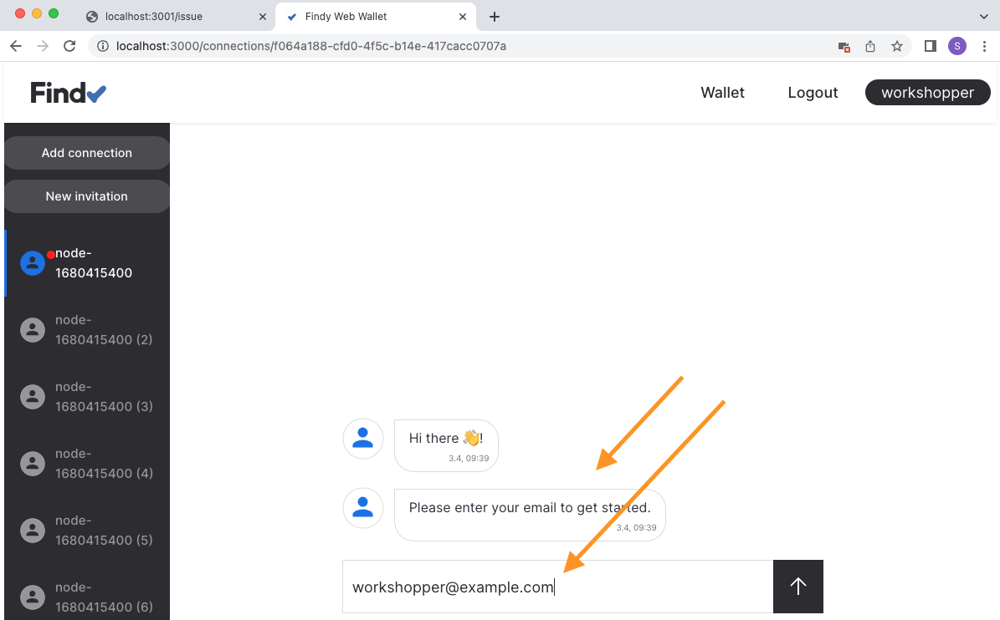
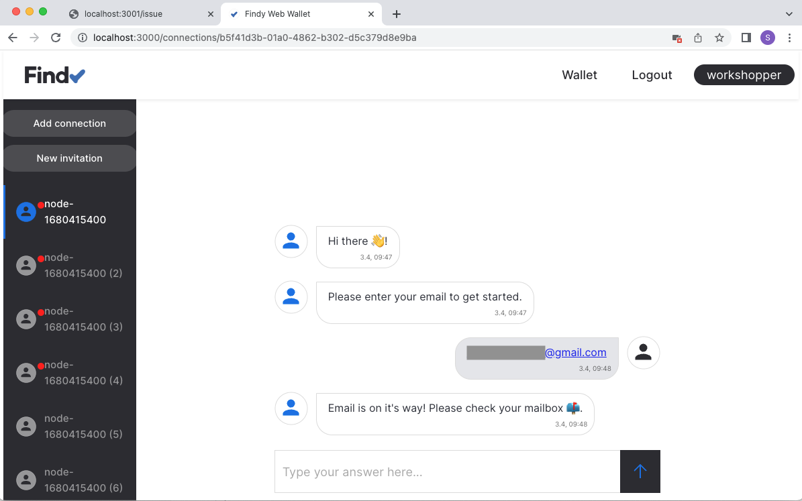
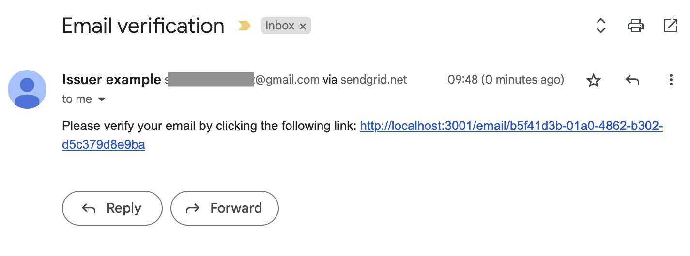

# Track 2.1 - Task 6: Issue credential for verified information

## Progress

* [Task 0: Setup environment](../README.md#task-0-setup-environment)
* [Task 1: Create a new connection](../task1/README.md#track-21---task-1-create-a-new-connection)
* [Task 2: Send greetings](../task2/README.md#track-21---task-2-send-greetings)
* [Task 3: Prepare for issuing credentials](../task3/README.md#track-21---task-3-prepare-for-issuing-credentials)
* [Task 4: Issue credential](../task4/README.md#track-21---task-4-issue-credential)
* [Task 5: Verify credential](../task5/README.md#track-21---task-5-verify-credential)
* **Task 6: Issue credential for verified information**
* [Task 7: Additional tasks](../task7/README.md#track-21---task-7-additional-tasks)

## Description

In our previous issuing example, we issued a `foobar` credential to anyone who connects with us.
However, this is not a likely real-world scenario. Probably the issuer wishes to issue some
meaningful data that it knows to be valid.

Let's change our issuer so that it issues credentials for a verified email. The issuer displays
a QR code as before, but when the connection is established, it will ask for the user's email address.
It sends an email with a verification URL to this address. Only when a user opens the verification URL
issuer will send the credential offer.

We must create a new schema and credential definition to issue email credentials. We also
need to create logic for asking for the email address. In addition, a new endpoint needs to be added
for the verification URL.

In this task, we will utilize SendGrid API for sending emails. You need an API key
to access the SendGrid API. You will be provided one in the guided workshop.

<details>
<summary>🤠 Acquire SendGrid API key</summary></br>

Create a free account to SendGrid and acquire the API key:
<https://sendgrid.com/solutions/email-api/>

Configure and verify also a sender identity for your email address.

</details></br>

## 1. Install SendGrid dependency

Stop your server (C-c).

Add a new dependency to your project:

```bash
npm install @sendgrid/mail --save
```

## 2. Export environment variables for SendGrid API access

Open file `.envrc`. Add two new environment variables there:

```bash
export SENDGRID_API_KEY='<this_value_will_be_provided_for_you_in_the_workshop>'
export SENDGRID_SENDER='<this_value_will_be_provided_for_you_in_the_workshop>'
```

Save the file and type `direnv allow`.

<details>
<summary>🤠 Configure your own SendGrid account</summary></br>

Create API key with SendGrid UI and replace the value to `SENDGRID_API_KEY` variable.
Configure the verified sender email to `SENDGRID_SENDER` variable.

</details></br>

## 3. Create new credential definition

In [task 3](../task3/README.md), we created a schema and credential definition for `foobar`-credentials.
Now we need another schema and credential definition for our email credential.

Let's modify our code for creating the schema and the credential definition.

Open file `src/prepare.ts`.

Modify function `prepareIssuing`. Change the `schemaName` to `'email'` and attributes list to `['email']`:

```ts
  const prepareIssuing = async (): Promise<string> => {
    // Schema name
    const schemaName = 'email'
    console.log(`Creating schema ${schemaName}`)

    const schemaMsg = new agencyv1.SchemaCreate()
    schemaMsg.setName(schemaName)
    schemaMsg.setVersion('1.0')
    // Schema attribute list
    schemaMsg.setAttributesList(['email'])

    const schemaId = (await agentClient.createSchema(schemaMsg)).getId()
    return await createCredDef(schemaId)
  }
```

Then delete (or rename) file `CRED_DEF_ID` from the workspace root.
This ensures that the schema and credential definition creation code is executed on server startup,
as there is no cached credential definition id.

```bash
mv CRED_DEF_ID foobar_CRED_DEF_ID
```

Restart your server `npm run dev`.

## 4. Ensure credential definition for email schema is created

Note! It will take a while for the agency to create a new credential definition.
Wait patiently.


## 5. Modify issuer for email changes

Open file `src/issue.ts`.

Add following row to imports:

```ts
import mailer from '@sendgrid/mail'
```

Add new functions `handleBasicMessageDone` and `setEmailVerified` to `Issuer`-interface:

```ts
export interface Issuer {
  addInvitation: (id: string) => void
  handleNewConnection: (info: ProtocolInfo, didExchange: ProtocolStatus.DIDExchangeStatus) => Promise<void>
  handleBasicMessageDone: (info: ProtocolInfo, basicMessage: ProtocolStatus.BasicMessageStatus) => Promise<void>
  handleIssueDone: (info: ProtocolInfo, issueCredential: ProtocolStatus.IssueCredentialStatus) => void
  setEmailVerified: (connectionId: string) => Promise<boolean>
}
```

Add new fields to `email` and `verified` to `Connection`-interface:

```ts
interface Connection {
  id: string
  email?: string
  verified?: boolean
}
```

Configure SendGrid API and add new utility functions `askForEmail` and `sendEmail`
for sending messages to the default exported function:

```ts
export default (protocolClient: ProtocolClient, credDefId: string) => {
  const connections: Connection[] = []

  // Configure API key for SendGrid API
  mailer.setApiKey(process.env.SENDGRID_API_KEY!)

  // Ask for user email via basic message
  const askForEmail = async (connectionId: string) => {
    const msg = new agencyv1.Protocol.BasicMessageMsg()
    msg.setContent('Please enter your email to get started.')
    await protocolClient.sendBasicMessage(connectionId, msg)
  }

  // Send email via SendGrid API
  const sendEmail = async (email: string, content: string) => {
    const emailMsg = {
      to: email,
      from: {
        email: process.env.SENDGRID_SENDER!,
        name: 'Issuer example',
      },
      subject: 'Email verification',
      text: content,
      html: content
    }
    console.log(`Sending email '${content}' to ${email}`)
    await mailer.send(emailMsg)
  }

...

}
```

Instead of issuing the credential when a new connection is established,
we want to ask the user for their email and send the credential offer
only after verifying their email. So when a new connection is established,
we send a basic message asking for the email.
Replace the contents of `handleNewConnection` with following:

```ts
  const handleNewConnection = async (info: ProtocolInfo, didExchange: ProtocolStatus.DIDExchangeStatus) => {
    // Skip if this connection was not for issuing
    const connection = connections.find(({ id }) => id === info.connectionId)
    if (!connection) {
      return
    }

    // Ask for email from the other end
    if (!connection.email) {
      await askForEmail(info.connectionId)
    }
  }
```

Add new function `handleBasicMessageDone`. This function will handle the basic messages the user
is sending from the other end. If the user replies with an email address, a verification email is sent
to the provided address.

```ts
  const handleBasicMessageDone = async (info: ProtocolInfo, basicMessage: ProtocolStatus.BasicMessageStatus) => {
    const connection = connections.find(({ id }) => id === info.connectionId)
    // Skip handling if message was sent by us or
    // the verification is already done
    if (basicMessage.getSentByMe() || !connection || connection.email) {
      return
    }
    console.log(`Basic message\n${JSON.stringify(basicMessage.toObject())}\nwith protocol id ${info.protocolId} completed with ${info.connectionId}`)

    // Some sanity checking
    const email = basicMessage.getContent()
    const emailValid = email.split(' ').length === 1 && email.indexOf('@') >= 0

    if (emailValid) {
      // Valid email, do verification
      connection.email = email
      // Create simple verification link
      // Note: in real-world we should use some random value instead of the connection id
      const content = `Please verify your email by clicking the following link:\n http://localhost:3001/email/${connection.id}`
      // Send verification mail
      await sendEmail(connection.email, content)

      // Send confirmation via basic message
      const msg = new agencyv1.Protocol.BasicMessageMsg()
      msg.setContent(`Email is on it's way! Please check your mailbox 📫.`)
      await protocolClient.sendBasicMessage(connection.id, msg)

    } else {
      // Email invalid, ask again
      await askForEmail(info.connectionId)
    }
  }
```

Add new function `setEmailVerified`. This function will send a credential offer
of a verified email when the user has clicked the verification link.

```ts
  const setEmailVerified = async (connectionId: string) => {
    const connection = connections.find(({ id }) => id === connectionId)

    if (!connection || !connection.email || connection.verified) {
      return false
    }

    connection.verified = true

    // Send credential offer for verified email
    const attributes = new agencyv1.Protocol.IssuingAttributes()
    const attr = new agencyv1.Protocol.IssuingAttributes.Attribute()
    attr.setName('email')
    attr.setValue(connection.email)
    attributes.addAttributes(attr)

    const credential = new agencyv1.Protocol.IssueCredentialMsg()
    credential.setCredDefid(credDefId)
    credential.setAttributes(attributes)

    console.log(`Sending credential offer\n${JSON.stringify(credential.toObject())}\nto ${connectionId}`)
    await protocolClient.sendCredentialOffer(connectionId, credential)

    return true
  }
```

And finally, update the list of returned functions with the newly created functions
`handleBasicMessageDone` and `setEmailVerified`:

```ts
...

export default (protocolClient: ProtocolClient, credDefId: string) => {

  ...

  return {
    addInvitation,
    handleNewConnection,
    handleBasicMessageDone,
    handleIssueDone,
    setEmailVerified
  }
}
```

## 5. Send new notifications to issuer from listener

Open file `src/listen.ts`.

We need to notify also issuer of the received basic messages so that
the issuer can handle the user-provided email address.

Replace the contents for `BasicMessageDone` with the following:

```ts
      ...

      BasicMessageDone: async (info, basicMessage) => {
        // Print out greeting sent from the other agent
        if (!basicMessage.getSentByMe()) {
          const msg = basicMessage.getContent()
          console.log(`Received basic message ${msg} from ${info.connectionId}`)
        }

        // Notify issuer
        issuer.handleBasicMessageDone(info, basicMessage)
      },

      ...
```

## 6. Add endpoint for email verification

Open file `src/index.ts`.

Add a new endpoint that handles email URL clicks.
The function asks the issuer to send a credential offer if the connection is valid and found.

```ts
  app.get('/email/:connectionId', async (req: Request, res: Response) => {
    const { connectionId } = req.params
    // Ask issuer to send credential offer for verified email
    if (await issuer.setEmailVerified(connectionId)) {
      res.send(`<html>
    <h1>Offer sent!</h1>
    <p>Please open your wallet application and accept the credential.</p>
    <p>You can close this window.</p></html>`);
    } else {
      res.send(`<html><h1>Error</h1></html>`);
    }
  });
```

## 7. Testing

Now you should have the needed bits and pieces in place. Let's test if it works.

Navigate to page <http://localhost:3001/issue> and
create a new pairwise connection to your web wallet user.
The app should ask you for your email. Input a valid email address that you have access to.



The application sends the verification email and basic message telling the user to check their inbox.



Check your inbox and navigate to the verification link with your desktop browser.



Check the web wallet view and accept the credential offer.


Review server logs.


## 8. Continue with task 7

Congratulations, you have completed task 6 and now know a little more about
how to build the application logic for issuers!

You can now continue with [task 7](../task7/README.md).
