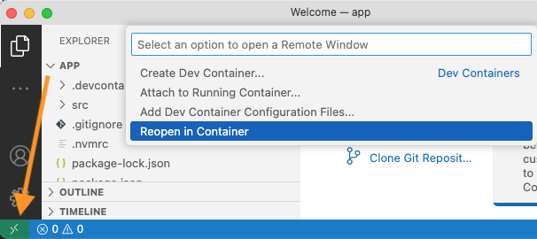
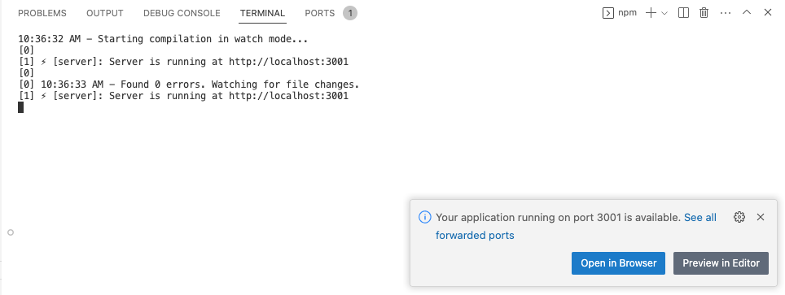

# Track 2.1: Typescript application

In this track, you will learn how to build a Typescript application that utilizes Findy Agency API
for issuing and verifying credentials. The assumption is that you are working in a guided workshop
with the default tooling. In this case you can skip the sections with symbol 🤠.

Follow the instructions carefully and execute the tasks in order. Good luck!

## Task 0: Setup environment

1. **Clone this repository** to your workspace:

    ```shell
    git clone https://github.com/findy-network/agency-demo.git
    ```

1. **Install tooling**

    The recommended tooling for the Typescript track is to use
    [the Dev Container feature](https://code.visualstudio.com/docs/devcontainers/containers) in VS Code.

    For **the recommended tooling**, you need to have the following:
      * [VS Code](https://code.visualstudio.com/)
      * [Docker](https://www.docker.com/)

      <details>
      <summary>🤠 Other options</summary>

      You can also set up the tools natively. However, these instructions describe only
      how to work with the recommended tooling.

      If you still wish to go to the wild side, make sure you have these tools available:

      * Code editor of your choice
      * [Node.js](https://nodejs.org/en) (or [nvm](https://github.com/nvm-sh/nvm#intro))
      * [findy-agent-cli](https://github.com/findy-network/findy-agent-cli#installation)
      * [direnv](https://direnv.net/) (*optional*)

      </details>

1. 🤠 Install Findy Agency

    If you are participating in a guided workshop,
    you will likely have a cloud installation of Findy Agency available. Skip this step.

      <details>
      <summary>🤠 Local setup</summary>

      Start local agency instance if you do not have cloud installation available.
      See instructions [here](../agency-local/README.md).

      </details>

1. **Open the Typescript application in a dev container**

    Open folder `./track2.1/app` to VS Code.

    VS Code asks if you want to develop the project in a dev container. Click "Reopen in Container."

    

    If you do not see this dialog, activate the dev container menu using the dev container button
    on the bottom left corner:

    

    It will take a while for VS Code to pull and set up your dev container.
    When it completes the process, VS Code opens a new Terminal window for you
    to the root of the Typescript application.

    

1. Set environment variables

    The agency environment provides a script for setting up the needed environment variables automatically.

    **Run following script** in the dev container terminal:

    ```bash
    source <(curl <agency_url>/set-env.sh)
    ```

    For cloud installation, use the cloud URL e.g. `https://agency.example.com`
    This URL is provided for you in the guided workshop.

    <details>
    <summary>🤠 Local setup</summary>

    For local agency installation, use the web wallet URL `http://localhost:3000`:

    ```bash
    source <(curl http://localhost:3000/set-env.sh)
    ```

    </details>

    The script will export the needed environment variables. It will also create file `.envrc`
    that contains these variables. Typing `direnv allow` will ensure that the variables
    are automatically exported when you open a new terminal window in this folder.

    <details>
    <summary>🤠 No direnv?</summary>

    If you don't have direnv installed, you can export the variables by typing `source .envrc`.

    </details>

    

    *Note! By default, the script will generate a generic username for your client.
    If you wish to use a more descriptive name for your app, define it before running the script:*

    ```bash
    export FCLI_USER="my-fancy-issuer-service"

    source <(curl <agency_url>/set-env.sh)
    ```

    *The username needs to be unique in the agency context.*

1. **Start the application** for the first time

    When starting the application for the first time, run following commands:

    ```bash
    nvm use
    npm install
    npm run build
    npm run dev     # start server in watch mode
    ```

    After the first start, you can use just `npm run dev`.

    When the server is started, VS Code displays a dialog telling where to find the app.

    

    Click "Open in Browser". The browser should open to URL <http://localhost:3001>
    and display the text "Typescript example".

    Now you have a simple express server running in port 3001 with four endpoints:
    `/`, `/greet`, `/issue` and `/verify`. Next step is to start adding some actual code
    to the server skeleton.

1. **Create connection to the agency**

    Add a new dependency to your project:

    ```bash
    npm install @findy-network/findy-common-ts --save
    ```

    `findy-common-ts` library has functionality that helps us authenticate to the agency
    or use the agent capabilities.

    Open file `src/index.ts`.

    Add following row to imports:

    ```ts
    import { createAcator, openGRPCConnection } from '@findy-network/findy-common-ts'
    ```

    Create new function `setupAgentConnection`:

    ```ts
      const setupAgentConnection = async () => {
        const acatorProps = {
          authUrl: process.env.FCLI_URL!,
          authOrigin: process.env.FCLI_ORIGIN!,
          userName: process.env.FCLI_USER!,
          key: process.env.FCLI_KEY!,
        }
        // Create authenticator
        const authenticator = createAcator(acatorProps)

        const serverAddress = process.env.AGENCY_API_SERVER!
        const certPath = process.env.FCLI_TLS_PATH!
        const grpcProps = {
          serverAddress,
          serverPort: parseInt(process.env.AGENCY_API_SERVER_PORT!, 10),
          // NOTE: we currently assume that we do not need certs for cloud installation
          // as the cert is issued by a trusted issuer
          certPath: serverAddress === 'localhost' ? certPath : ''
        }

        // Open gRPC connection to agency using authenticator
        return openGRPCConnection(grpcProps, authenticator)
      }
    ```

    This function will open a connection to our agent. Through this connection, we can control
    the agent and listen for any events the agent produces while handling our credential protocol
    flows.

    We authenticate the client using a headless FIDO2 authenticator provided by the agency helper
    library. When opening the connection for the first time, the underlying functionality
    automatically registers the authenticator to our agent. The `FCLI_KEY` variable contains the
    master key to your authenticator. It is generated during the development environment setup.
    (In production the key should be naturally generated and handled properly as a secret).
    If someone gets access to the secret key, they can control your agent.

    Add call to `setupAgentConnection` to existing `runApp` function:

    ```ts
    const runApp = async () => {

      await setupAgentConnection()

      ...
    }
    ```

    As you can see from the logs, the authentication fails at first as the client is not yet registered.
    With further server starts, this error should disappear.

    Verify that you see logs similar to this:
    

1. **Continue with task 1**

    Congratulations, you have completed task 0 and have
    a working agency client development environment available!

    You can now continue with [task 1](./task1/README.md).
