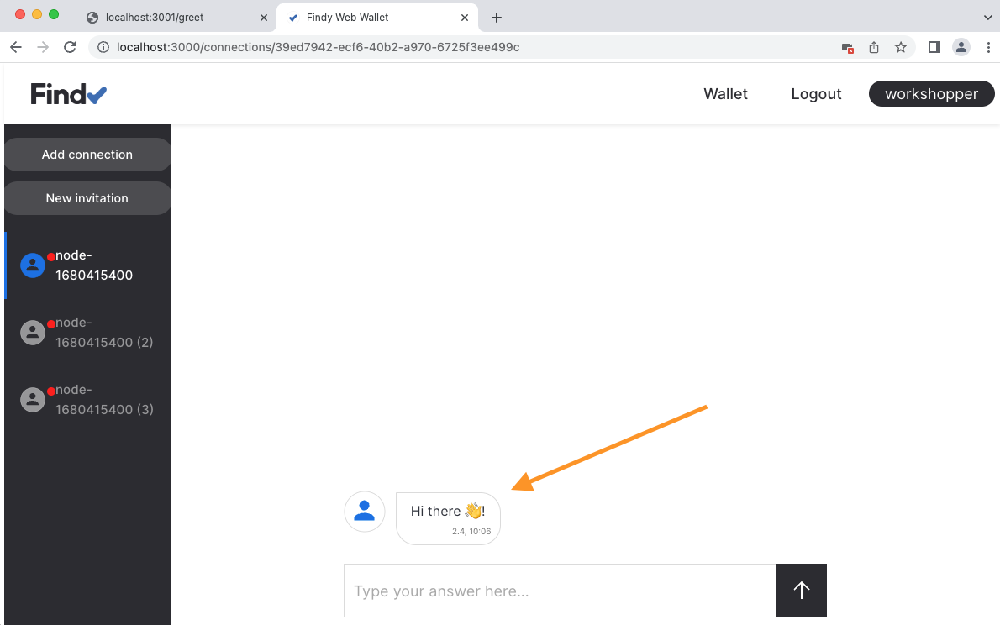
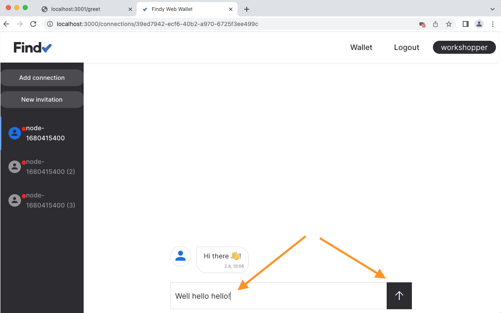

# Track 2.1 - Task 2: Send greetings

## Progress

* [Task 0: Setup environment](../README.md#task-0-setup-environment)
* [Task 1: Create a new connection](../task1/README.md#track-21---task-1-create-a-new-connection)
* **Task 2: Send greetings**
* [Task 3: Prepare for issuing credentials](../task3/README.md#track-21---task-3-prepare-for-issuing-credentials)
* [Task 4: Issue credential](../task4/README.md#track-21---task-4-issue-credential)
* [Task 5: Verify credential](../task5/README.md#track-21---task-5-verify-credential)
* [Task 6: Issue credential for verified information](../task6/README.md#track-21---task-6-issue-credential-for-verified-information)
* [Task 7: Additional tasks](../task7/README.md#track-21---task-7-additional-tasks)

## Description

In the previous task, we learned how to establish e2e-encrypted messaging pipes between agents. Now
we send our first messages using this communication pipe.

Agents interact using Hyperledger Aries protocols. There are different protocols for different purposes.
Agents send text messages to each other using
[basic message protocol](https://github.com/hyperledger/aries-rfcs/blob/main/features/0095-basic-message/README.md).

## 1. Use protocol API client to send a text to the other agent

In the previous task, we added a handler for new connection notifications.
Modify this handler so that when a new connection gets created, we send a greeting
to the other agent.

Open file `src/listen.ts`.

Add **`agencyv1`** to objects imported from `findy-common-ts`:

```ts
import { agencyv1, AgentClient, ProtocolClient } from '@findy-network/findy-common-ts'
```

Modify handler `DIDExchangeDone` to following:

```ts
      // New connection is established
      DIDExchangeDone: async (info, didExchange) => {
        console.log(`New connection: ${didExchange.getTheirLabel()} with id ${info.connectionId}`)

        // Greet each new connection with basic message
        const msg = new agencyv1.Protocol.BasicMessageMsg()
        msg.setContent('Hi there 👋!')
        await protocolClient.sendBasicMessage(info.connectionId, msg)
      },
```

## 2. Ensure the message is sent to the web wallet

Refresh the `/greet`-page and create a new connection using the web wallet UI.
Check that the greeting is received in the web wallet UI.



## 3. Add handler for received messages

Continue editing file `src/listen.ts`.

Add new handler `BasicMessageDone` to listener.
When receiving messages from other agents, print them to log:

```ts
      DIDExchangeDone: async (info, didExchange) => {
        ...
      },

      BasicMessageDone: async (info, basicMessage) => {
        // Print out greeting sent from the other agent
        if (!basicMessage.getSentByMe()) {
          const msg = basicMessage.getContent()
          console.log(`Received basic message ${msg} from ${info.connectionId}`)
        }
      },
```

## 4. Ensure the received message is printed to logs

Send a reply from the web wallet UI:



Check that the sent message is visible in the server logs:


## 5. Continue with task 3

Congratulations, you have completed task 2, and now know how to send basic messages
with the Hyperledger Aries protocol!

You can now continue with [task 3](../task3/README.md).
