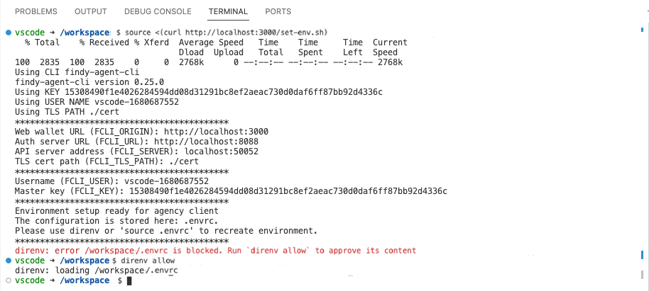
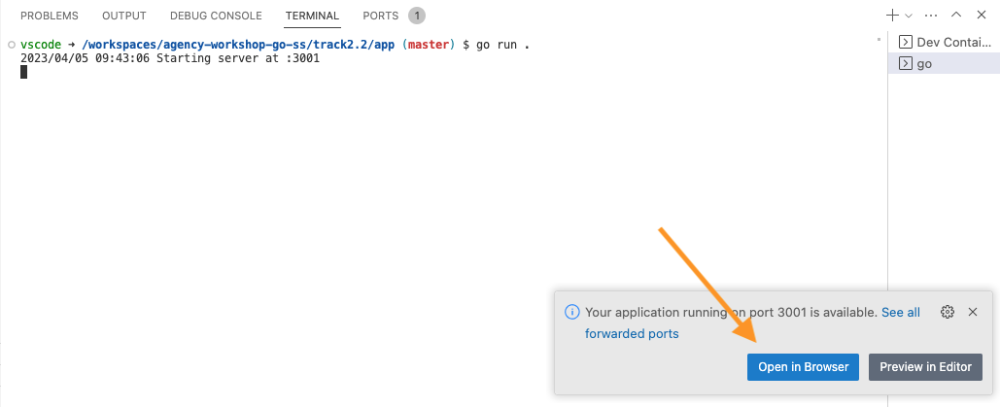

# Track 2.2: Go application

In this track, you will learn how to build a Go application that utilizes Findy Agency API
for issuing and verifying credentials. The assumption is that you work in a guided workshop
with the default tooling. In this case, you can skip the sections with the symbol 🤠.

The workshop contains seven tasks:

* **[Task 0: Setup environment](#task-0-setup-environment)**
* [Task 1: Create a new connection](./task1/README.md#track-21---task-1-create-a-new-connection)
* [Task 2: Send greetings](./task2/README.md#track-21---task-2-send-greetings)
* [Task 3: Prepare for issuing credentials](./task3/README.md#track-21---task-3-prepare-for-issuing-credentials)
* [Task 4: Issue credential](./task4/README.md#track-21---task-4-issue-credential)
* [Task 5: Verify credential](./task5/README.md#track-21---task-5-verify-credential)
* [Task 6: Issue credential for verified information](./task6/README.md#track-21---task-6-issue-credential-for-verified-information)
* [Task 7: Additional tasks](./task7/README.md#track-21---task-7-additional-tasks)

Follow the instructions carefully and execute the tasks in order. Good luck!

## Task 0: Setup environment

### **1. Clone this repository to your workspace**

```shell
git clone https://github.com/findy-network/agency-workshop.git
```

### **2. Install tooling**

The recommended tooling for the Typescript track is to use
[the Dev Container feature](https://code.visualstudio.com/docs/devcontainers/containers) in VS Code.

For the recommended tooling, you need to have the following:

* [VS Code](https://code.visualstudio.com/)
* [Docker](https://www.docker.com/)

<details>
<summary>🤠 Other options</summary></br>

You can also set up the tools natively. However, these instructions describe only
how to work with the recommended tooling.

If you still wish to go to the wild side, make sure you have these tools available:

* Code editor of your choice
* [Go](https://go.dev/dl/)
* [findy-agent-cli](https://github.com/findy-network/findy-agent-cli#installation)
* [direnv](https://direnv.net/) (*optional*)

</details><br/>

### **3. 🤠 Install Findy Agency**

If you are participating in a guided workshop,
you will likely have a cloud installation of Findy Agency available. Skip this step.

<details>
<summary>🤠 Local setup</summary></br>

Start local agency instance if you do not have cloud installation available.
See instructions [here](../agency-local/README.md).

</details><br/>

### **4. Open the Go application in a dev container**

Open folder `./track2.2-go/app` in VS Code.

VS Code asks if you want to develop the project in a dev container. Click "Reopen in Container."


If you do not see this dialog, activate the dev container menu using the dev container button
on the bottom left corner:


It will take a while for VS Code to pull and set up your dev container.
When the process completes, open a new terminal window (*Terminal* > *New terminal*).


### **5. Set environment variables**

The agency environment provides a script for automatically setting up the needed environment variables.

Run the following script in the dev container terminal:

```bash
source <(curl <agency_url>/set-env.sh)
```

The agency URL is provided for you in the guided workshop. e.g., `https://agency.example.com`

<details>
<summary>🤠 Local setup</summary></br>

For local agency installation, use the web wallet URL `http://localhost:3000`:

```bash
source <(curl http://localhost:3000/set-env.sh)
```

</details><br/>

The script will export the needed environment variables. It will also create a file `.envrc`
that contains these variables. Typing `direnv allow` will ensure that the variables
are automatically exported when you open a new terminal window in this folder.



<details>
<summary>🤠 No direnv?</summary></br>

If you don't have direnv installed, you can export the variables by typing `source .envrc`.

</details><br/>

*Note! By default, the script will generate a generic username for your client.
If you wish to use a more descriptive name for your app, define it before running the script:*

```bash
export FCLI_USER="my-fancy-issuer-service"

source <(curl <agency_url>/set-env.sh)
```

*The username needs to be unique in the agency context.*

### **6. Start the application**

  Run the following command:

  ```bash
  go run .
  ```

  When the server is started, VS Code displays a dialog telling where to find the app.

  

  Click "Open in Browser". The browser should open to URL <http://localhost:3001>
  and display the text *"Go example"*.

  Now you have a simple express server running in port 3001 with four endpoints:
  `/`, `/greet`, `/issue`, and `/verify`. The next step is to start adding some actual code
  to the server skeleton.

### **7. Create the agency connection**

Add new dependencies to your project. Type to terminal:

```bash
go get github.com/findy-network/findy-agent-auth
go get github.com/findy-network/findy-common-go
```

[`findy-agent-auth`](https://github.com/findy-network/findy-agent-auth)
library has functionality that helps us authenticate to the agency.

[`findy-common-go`](https://github.com/findy-network/findy-common-go)
library has functionality that helps us control our agent.

Create a new file `agent/auth.go`.

Add the following content to the new file:

```go
package agent

import (
  "log"
  "os"
  "strconv"

  "github.com/findy-network/findy-agent-auth/acator/authn"
  "github.com/findy-network/findy-common-go/agency/client"
  agency "github.com/findy-network/findy-common-go/grpc/agency/v1"
  "github.com/lainio/err2"
  "github.com/lainio/err2/try"
  "google.golang.org/grpc"
)

const (
  subCmdLogin    = "login"
  subCmdRegister = "register"
)

type AgencyClient struct {
  Conn           client.Conn
  AgentClient    agency.AgentServiceClient
  ProtocolClient agency.ProtocolServiceClient
}

func execAuthCmd(cmd string) (res authn.Result, err error) {
  defer err2.Handle(&err)

  myCmd := authn.Cmd{
    SubCmd:   subCmdLogin,
    UserName: os.Getenv("FCLI_USER"),
    Url:      os.Getenv("FCLI_URL"),
    AAGUID:   "12c85a48-4baf-47bd-b51f-f192871a1511",
    Key:      os.Getenv("FCLI_KEY"),
    Counter:  0,
    Token:    "",
    Origin:   os.Getenv("FCLI_ORIGIN"),
  }

  myCmd.SubCmd = cmd

  try.To(myCmd.Validate())

  return myCmd.Exec(os.Stdout)
}

func LoginAgent() (
  agencyClient *AgencyClient,
  err error,
) {
  defer err2.Handle(&err)

  // first try to login
  res, firstTryErr := execAuthCmd(subCmdLogin)
  if firstTryErr != nil {
    // if login fails, try to register and relogin
    _ = try.To1(execAuthCmd(subCmdRegister))
    res = try.To1(execAuthCmd(subCmdLogin))
  }

  log.Println("Agent login succeeded")

  token := res.Token
  // set up API connection
  conf := client.BuildClientConnBase(
    os.Getenv("FCLI_TLS_PATH"),
    os.Getenv("AGENCY_API_SERVER"),
    try.To1(strconv.Atoi(os.Getenv("AGENCY_API_SERVER_PORT"))),
    []grpc.DialOption{},
  )

  conn := client.TryAuthOpen(token, conf)

  return &AgencyClient{
    Conn:           conn,
    AgentClient:    agency.NewAgentServiceClient(conn),
    ProtocolClient: agency.NewProtocolServiceClient(conn),
  }, nil
}

```

The `LoginAgent` function will open a connection to our agent. Through this connection, we can control
the agent and listen for any events the agent produces while handling our credential protocol
flows.

We authenticate the client using a headless FIDO2 authenticator provided by the agency helper
library. When opening the connection for the first time, the functionality in
the `LoginAgent`-function registers the authenticator to our agent.

The `FCLI_KEY` variable contains the master key to your authenticator. It is generated during
the development environment setup. (In production, the key should be naturally generated and
handled in a secure manner as a secret). If someone gets access to the key,
they can control your agent.

Open file `main.go`

Add call to `LoginAgent` to existing `main` function:

```go
import (

  ...

  "github.com/findy-network/agency-workshop/agent"

  ...

)

func main() {
  defer err2.Catch(func(err error) {
    log.Fatal(err)
  })

  // Login agent
  _ = try.To1(agent.LoginAgent())

  ...

}
```

Restart server and verify that you see text *"Agent login succeeded"*:


### **8. Continue with task 1**

Congratulations, you have completed task 0 and have
a working agency client development environment available!

You can now continue with [task 1](./task1/README.md).
