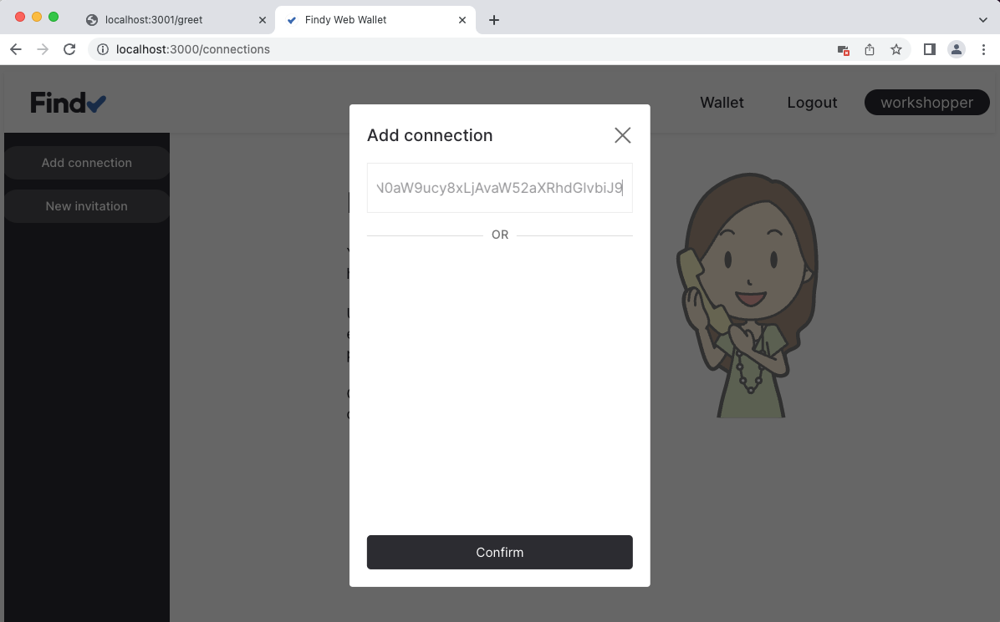
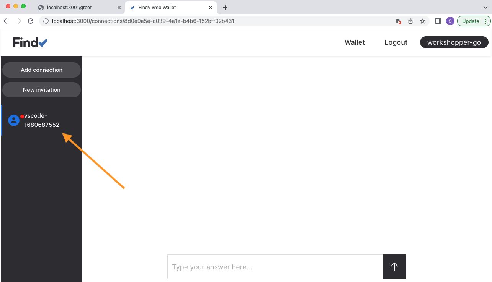

# Track 2.2 - Task 1: Create a new connection

## Progress

* [Task 0: Setup environment](../README.md#task-0-setup-environment)
* **Task 1: Create a new connection**
* [Task 2: Send greetings](../task2/README.md#track-22---task-2-send-greetings)
* [Task 3: Prepare for issuing credentials](../task3/README.md#track-22---task-3-prepare-for-issuing-credentials)
* [Task 4: Issue credential](../task4/README.md#track-22---task-4-issue-credential)
* [Task 5: Verify credential](../task5/README.md#track-22---task-5-verify-credential)
* [Task 6: Issue credential for verified information](../task6/README.md#track-22---task-6-issue-credential-for-verified-information)
* [Task 7: Additional tasks](../task7/README.md#track-22---task-7-additional-tasks)

## Description

An agent's primary capability is peer-to-peer messaging, which allows for exchanging messages
between agents. These interactions can range from simple plaintext messages to more complex tasks
such as negotiating the issuance of a credential or presenting proof. The peer-to-peer
messaging mechanism is called DIDComm, which is short for DID communication and operates based
on the exchange and use of DIDs.

Establishing a DIDComm connection requires one agent to generate an invitation and
transfer the invitation to the other agent. Typically the invitation is displayed as a QR code
that the other agent can read using a mobile device. The connection negotiation can then begin using
the information in the invitation. Eventually, the agents have a secure, e2e-encrypted
communication pipeline that they can use to transmit other protocol messages.

### Task sequence


In this task:

1. We will create a new web wallet user (if we don't already have one).
The user will navigate to our application's *Greet*-page.
1. The application will generate a new pairwise invitation each time the *Greet*-page is loaded.
1. The application's agent hosted by the agency will handle the actual invitation generation.
1. The application will render the invitation string as QR code and display it to the wallet user.
1. The wallet user will use her web wallet to read the QR code.
1. Reading of the QR code starts **Aries connection protocol** between the user's and the application's agents.
1. Once the protocol is complete, the wallet user is notified of the new connection.
1. Once the protocol is complete, the application is notified of the new connection.

```mermaid
sequenceDiagram
    autonumber
    participant Client Application
    participant Application Agent
    participant User Agent
    actor Wallet User

    Wallet User->>Client Application: Navigate to http://localhost:3001/greet
    Client Application->>Application Agent: Generate invitation
    Application Agent-->>Client Application: <<invitation URL>>
    Client Application-->>Wallet User: Show invitation QR code
    Wallet User->>User Agent: Read QR code
    Note right of Application Agent: Aries Connection protocol
    User Agent->>Application Agent: Establish DIDComm pipe
    User Agent->>Wallet User: <<New connection!>>
    Application Agent->>Client Application: <<New connection!>>
```

## 1. Add library for creating QR codes

Add a new dependency to your project:

```bash
go get github.com/skip2/go-qrcode
```

This library will enable us to transform strings into QR codes.

Open file `main.go`.

Add following rows to imports:

```go
import (

  ...
  agency "github.com/findy-network/findy-common-go/grpc/agency/v1"
  qrcode "github.com/skip2/go-qrcode"
)
```

## 2. Create a connection invitation

Add new function `createInvitationPage` for creating an HTML page
with connection invitation information:

```go
func createInvitationPage(
  agentClient agency.AgentServiceClient,
  header string,
) (html, invitationID string, err error) {
  defer err2.Handle(&err)

  // Agency API call for creating the DIDComm connection invitation
  res := try.To1(agentClient.CreateInvitation(
    context.TODO(),
    // Whichever name we want to expose from ourselves to the other end
    &agency.InvitationBase{Label: os.Getenv("FCLI_USER")},
  ))

  var invitationMap map[string]any
  try.To(json.Unmarshal([]byte(res.GetJSON()), &invitationMap))

  url := res.URL
  log.Printf("Created invitation\n %s\n", url)

  // Convert invitation string to QR code
  png, err := qrcode.Encode(url, qrcode.Medium, 512)
  imgSrc := "data:image/png;base64," + base64.StdEncoding.EncodeToString([]byte(png))

  // Create HTML payload
  html = `<html>
      <h1>` + header + `</h1>
      <p>Read the QR code with the wallet application:</p>
      
      <p>or copy-paste the invitation:</p>
      <textarea onclick="this.focus();this.select()" readonly="readonly" rows="10" cols="60">` +
    url + `</textarea></html>`

  // Return invitation id and the HTML payload
  return invitationMap["@id"].(string), html, nil
}
```

## 3. Implement the `/greet`-endpoint

Let's add implementation to the `/greet`-endpoint.
The function should respond with an HTML page that renders a QR code for a DIDComm connection invitation.

First, store the agent API client reference returned when opening the agency connection.
Add new field `agentClient` to `app`-struct:

```go
type app struct {
  agencyClient *agent.AgencyClient
}
```

Modify `main`-call to the following:

```go
func main() {

  ...

  // Login agent
  agencyClient := try.To1(agent.LoginAgent())

  myApp := app{
    agencyClient: agencyClient,
  }

  ...

}

```

Then, replace the implementation of the `/greet`-endpoint to the following:

```go
// Show pairwise invitation. Once connection is established, send greeting.
func (a *app) greetHandler(response http.ResponseWriter, r *http.Request) {
  defer err2.Catch(func(err error) {
    log.Println(err)
    http.Error(response, err.Error(), http.StatusInternalServerError)
  })
  // Create HTML payload
  _, html := try.To2(createInvitationPage(a.agencyClient.AgentClient, "Greet"))
  // Render HTML
  try.To1(response.Write([]byte(html)))
}
```

## 4. Test the `/greet`-endpoint

Make sure the server is restarted (`go run .`).
Open a browser window to <http://localhost:3001/greet>

*You should see a simple web page with a QR code and a text input with a prefilled string.*


## 5. Register test user to web wallet

You should read the QR code with the web wallet to test the connection creation.
Navigate to the web wallet URL with your mobile device or open a new tab in your desktop browser.

*You can find the web wallet URL in the `.envrc`-file stored in your workspace root.
Navigate with your browser to the URL that is stored in the `FCLI_ORIGIN`-variable.*

<details>
<summary>🤠 Local setup</summary></br>

If you are using a local agency installation, you should use your desktop browser only.

</details><br/>

Pick a unique username for your web wallet user. Register and log in with your web wallet user
using your touch/face id. See the gif below if in doubt.


<details>
<summary>🤠 Authenticator emulation</summary></br>

FIDO2 authenticators can also be emulated. See [Chrome instructions](https://developer.chrome.com/docs/devtools/webauthn/)
for more information.

</details><br/>

## 6. Read the QR code with the web wallet

Tap the "Add connection" button in your web wallet and read the QR code with your mobile device. Alternatively,
copy-paste the invitation string to the input-field and click *Confirm*.



## 7. Ensure the new connection is visible in the web wallet

Check that the connections list displays the name of your client application,
and a messaging UI is visible for you.



## 8. Add agent listener

Now we have a new pairwise connection to the web wallet user that the agent negotiated for us.
However, we don't know about it, as we haven't set a listener for our agent. Let's do that next.

Create a new file `agent/listen.go`.

Add the following content to the new file:

```go
package agent

import (
  "context"
  "log"

  agency "github.com/findy-network/findy-common-go/grpc/agency/v1"
  "github.com/google/uuid"
  "github.com/lainio/err2/try"
)

type Listener interface {
  HandleNewConnection(*agency.Notification, *agency.ProtocolStatus_DIDExchangeStatus)
}

func (agencyClient *AgencyClient) Listen(listeners []Listener) {

  // Listening callback handles agent events
  ch := try.To1(
    agencyClient.Conn.ListenStatus(
    context.TODO(),
    &agency.ClientID{ID: uuid.New().String()},
    ),
  )

  // Go routine for listening event channel
  go func() {
    for {
    chRes, ok := <-ch
    if !ok {
      panic("Listening failed")
    }

    notification := chRes.GetNotification()
    log.Printf("Received agent notification %v\n", notification)

    // Fetch detailed status information for notification
    status := try.To1(
      agencyClient.ProtocolClient.Status(
      context.TODO(),
      &agency.ProtocolID{
        ID:     notification.ProtocolID,
        TypeID: notification.ProtocolType,
      },
      ),
    )

    // Notify listeners of protocol events
    switch notification.GetTypeID() {
    case agency.Notification_STATUS_UPDATE:
      if status.State.State == agency.ProtocolState_OK {
        switch notification.GetProtocolType() {
        case agency.Protocol_DIDEXCHANGE:
          for _, listener := range listeners {
            listener.HandleNewConnection(notification, status.GetDIDExchange())
          }
        default:
          log.Printf("No handler for protocol message %s\n", notification.GetProtocolType())
        }
      } else {
        log.Printf("Status NOK %v for %s\n", status, notification.GetProtocolType())
      }
    default:
      log.Printf("No handler for notification %s\n", notification.GetTypeID())
    }

    }
  }()

}

```

Create folder `handlers`.
Create a new file `handlers/greeter.go`.

This module will handle our greeting functionality: for now,
we just print the name of the other agent to logs.
Add the following content to the new file:

```go
package handlers

import (
  "log"

  "github.com/findy-network/agency-workshop/agent"
  "github.com/findy-network/findy-common-go/agency/client"
  agency "github.com/findy-network/findy-common-go/grpc/agency/v1"
)

type Greeter struct {
  agent.DefaultListener
  conn client.Conn
}

func NewGreeter(conn client.Conn) *Greeter {
  return &Greeter{conn: conn}
}

func (g *Greeter) HandleNewConnection(
  notification *agency.Notification,
  status *agency.ProtocolStatus_DIDExchangeStatus,
) {
  // Print their label to logs
  log.Printf("New connection %s with id %s", status.TheirLabel, notification.ConnectionID)
}

```

Open file `main.go`.

Next, we will modify `main`-function to start the listening.
We will provide an instance of the newly created struct `Greeter` as the parameter to the listener.

```go
import (
  ...

  "github.com/findy-network/agency-workshop/handlers"

  ...
)

type app struct {
  agencyClient *agent.AgencyClient
  // Store greeter handler to app state
  greeter      *handlers.Greeter
}


  ...

func main() {

  ...

  // Login agent
  agencyClient := try.To1(agent.LoginAgent())

  // Create handlers
  myApp := app{
    agencyClient: agencyClient,
    greeter:      handlers.NewGreeter(agencyClient.Conn),
  }

  // Start listening
  myApp.agencyClient.Listen([]agent.Listener{
    // Greeter handles the greeting logic
    myApp.greeter,
  })

  ...

}
```

## 9. Check the name of the web wallet user

Restart the server, refresh the `/greet`-page and create a new connection using the web wallet UI.

Check that the server logs print out the web wallet user name.


## 10. Continue with task 2

Congratulations, you have completed task 1, and you know now how to establish DIDComm connections
between agents for message exchange!
To revisit what happened, check [the sequence diagram](#task-sequence).

You can now continue with [task 2](../task2/README.md).
