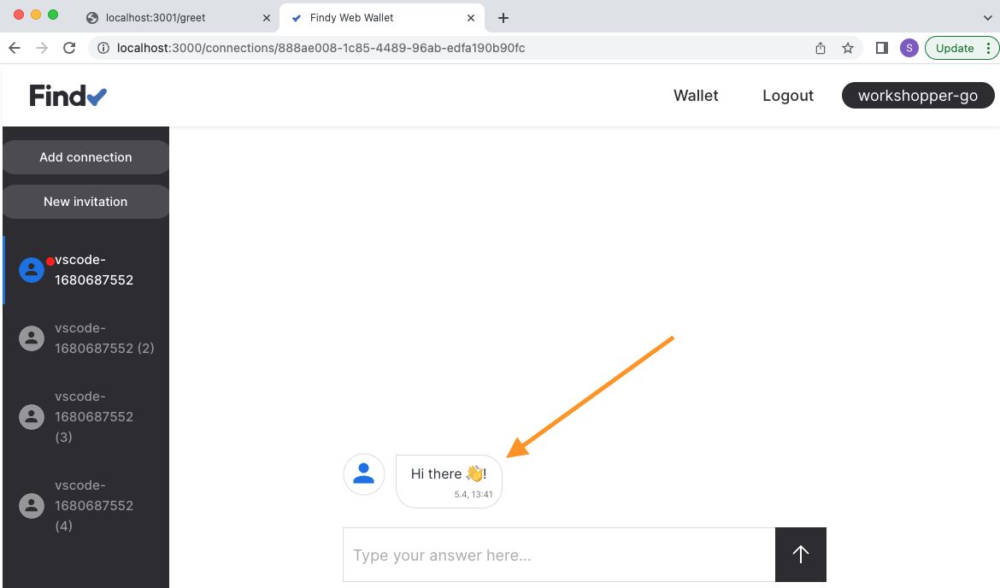

# Track 2.2 - Task 2: Send greetings

## Progress

* [Task 0: Setup environment](../README.md#task-0-setup-environment)
* [Task 1: Create a new connection](../task1/README.md#track-22---task-1-create-a-new-connection)
* **Task 2: Send greetings**
* [Task 3: Prepare for issuing credentials](../task3/README.md#track-22---task-3-prepare-for-issuing-credentials)
* [Task 4: Issue credential](../task4/README.md#track-22---task-4-issue-credential)
* [Task 5: Verify credential](../task5/README.md#track-22---task-5-verify-credential)
* [Task 6: Issue credential for verified information](../task6/README.md#track-22---task-6-issue-credential-for-verified-information)
* [Task 7: Additional tasks](../task7/README.md#track-22---task-7-additional-tasks)

## Description

In the previous task, we learned how to establish e2e-encrypted messaging pipes between agents. Now
we send our first messages using this communication pipe.

Agents interact using Hyperledger Aries protocols. There are different protocols for different purposes.
Agents send text messages to each other using
[basic message protocol](https://github.com/hyperledger/aries-rfcs/blob/main/features/0095-basic-message/README.md).

### Task sequence

In this task:

We will create a new connection according to [the steps in task 1](../task1/README.md#task-sequence).
We have already the logic for that in place.
In addition, we will add logic to the application to send and receive basic messages:

1. Once the connection protocol is complete, the application is notified of the new connection.
1. Application sends a greeting to the new connection.
1. Application agent initiates the Aries basic message protocol.
1. Once the protocol is completed, the application is notified of the message sending success.
1. Once the protocol is completed, the wallet user is notified of the received message.
1. Wallet user sends a message to the application.
1. User agent initiates the Aries basic message protocol.
1. Once the protocol is completed, the wallet user is notified of the message sending success
(message is displayed in the chat view).
1. Once the protocol is completed, the application is notified of the received message.

```mermaid
sequenceDiagram
    autonumber
    participant Client Application
    participant Application Agent
    participant User Agent
    actor Wallet User

    Application Agent->>Client Application: <<New connection!>>
    rect rgb(191, 223, 255)
    Client Application->>Application Agent: Send greeting
    Note right of Application Agent: Aries Basic message protocol
    Application Agent->>User Agent: Send message
    Application Agent->>Client Application: <<Message sent!>>
    User Agent->>Wallet User: <<Message received!>>
    end
    rect rgb(191, 191, 255)
    Wallet User->>User Agent: Send greeting
    Note right of Application Agent: Aries Basic message protocol
    User Agent->>Application Agent: Send message
    User Agent->>Wallet User: <<Message sent!>>
    Application Agent->>Client Application: <<Message received!>>
    end
```

## 1. Use protocol API client to send a text to the other agent

In the previous task, we added a handler for new connection notifications.
Modify this handler so that when a new connection gets created, we send a greeting
to the other agent.

Open file `handlers/greeter.go`.

Modify handler `HandleNewConnection` to following:

```go
func (g *Greeter) HandleNewConnection(
 notification *agency.Notification,
 status *agency.ProtocolStatus_DIDExchangeStatus,
) {
  defer err2.Catch(func(err error) {
    log.Printf("Error handling new connection: %v", err)
  })

  log.Printf("New connection %s with id %s", status.TheirLabel, notification.ConnectionID)

  // Greet each new connection with basic message
  pw := async.NewPairwise(g.conn, notification.ConnectionID)
  _ = try.To1(pw.BasicMessage(context.TODO(), "Hi there 👋!"))
}
```

## 2. Ensure the message is sent to the web wallet

Restart the server, refresh the `/greet`-page and create a new connection using the web wallet UI.
Check that the greeting is received in the web wallet UI.



## 3. Add handler for received messages

Open file `agent/listen.go`.

Add new method `HandleBasicMesssageDone` to `Listener` interface:

```go
type Listener interface {
  HandleNewConnection(*agency.Notification, *agency.ProtocolStatus_DIDExchangeStatus)
  // Send notification to listener when basic message protocol is completed
  HandleBasicMesssageDone(*agency.Notification, *agency.ProtocolStatus_BasicMessageStatus)
}
```

When receiving messages from other agents, notify listeners via the new method.
Edit `Listen`-function:

```go

  ...

func (agencyClient *AgencyClient) Listen(listeners []Listener) {

  ...

   // Notify listeners of protocol events
    switch notification.GetTypeID() {
    case agency.Notification_STATUS_UPDATE:
      if status.State.State == agency.ProtocolState_OK {
      switch notification.GetProtocolType() {
        case agency.Protocol_DIDEXCHANGE:
          for _, listener := range listeners {
            listener.HandleNewConnection(notification, status.GetDIDExchange())
          }
          // Notify basic message protocol events
        case agency.Protocol_BASIC_MESSAGE:
          for _, listener := range listeners {
            listener.HandleBasicMesssageDone(notification, status.GetBasicMessage())
          }

      ... 
   }

  ...

}
```

Open file `handlers/greeter.go`.
Handle basic messages in `Greeter` module. Add new function `HandleBasicMesssageDone`
and print messages to log:

```go
func (g *Greeter) HandleBasicMesssageDone(
  notification *agency.Notification,
  status *agency.ProtocolStatus_BasicMessageStatus,
) {
  // Print out greeting sent from the other agent
  if !status.SentByMe {
    log.Printf("Received basic message %s from %s", status.Content, notification.ConnectionID)
  }
}
```

## 4. Ensure the received message is printed to logs

Restart server. Send a reply from the web wallet UI:


Check that the sent message is visible in the server logs:


## 5. Continue with task 3

Congratulations, you have completed task 2, and now know how to send and receive
basic messages with the Hyperledger Aries protocol!
To revisit what happened, check [the sequence diagram](#task-sequence).

You can now continue with [task 3](../task3/README.md).
