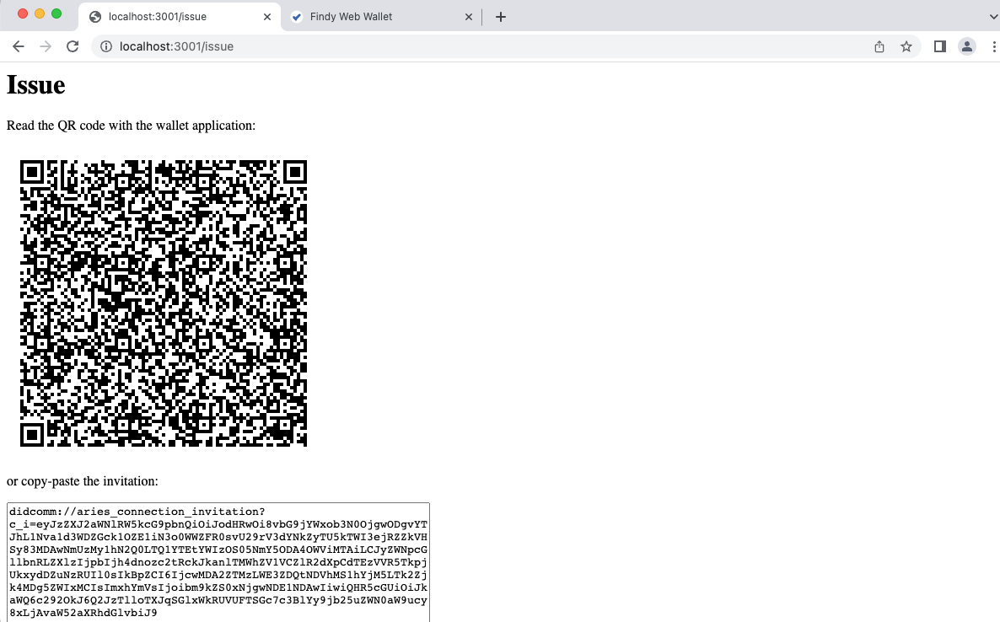

# Track 2.2 - Task 4: Issue credential

## Progress

* [Task 0: Setup environment](../README.md#task-0-setup-environment)
* [Task 1: Create a new connection](../task1/README.md#track-21---task-1-create-a-new-connection)
* [Task 2: Send greetings](../task2/README.md#track-21---task-2-send-greetings)
* [Task 3: Prepare for issuing credentials](../task3/README.md#track-21---task-3-prepare-for-issuing-credentials)
* **Task 4: Issue credential**
* [Task 5: Verify credential](../task5/README.md#track-21---task-5-verify-credential)
* [Task 6: Issue credential for verified information](../task6/README.md#track-21---task-6-issue-credential-for-verified-information)
* [Task 7: Additional tasks](../task7/README.md#track-21---task-7-additional-tasks)

## Description

Now that we have completed setting up the basic bells and whistles, we can start the real fun
with issuing and verifying credentials.

First, let's issue a dummy credential to the web wallet user and verify it afterward.
In a real-world application, the issuer would naturally know something about the user
and issue a credential only with validated information. But for this case,
we issue a dummy credential to all users connecting with us.

Agents use [the issue credential protocol](https://github.com/hyperledger/aries-rfcs/blob/main/features/0036-issue-credential/README.md)
when handling the issuing process. Luckily, Findy Agency handles the execution of this complex
protocol for us (similarly to other Hyperledger Aries protocols).

## 1. Add code for issuing logic

Create a new file `src/issue.ts`.

Add the following content to the new file:

```ts
import { agencyv1, ProtocolClient, ProtocolInfo } from '@findy-network/findy-common-ts'
import { ProtocolStatus } from '@findy-network/findy-common-ts/dist/idl/protocol_pb'

export interface Issuer {
  addInvitation: (id: string) => void
  handleNewConnection: (info: ProtocolInfo, didExchange: ProtocolStatus.DIDExchangeStatus) => Promise<void>
  handleIssueDone: (info: ProtocolInfo, issueCredential: ProtocolStatus.IssueCredentialStatus) => void
}

interface Connection {
  id: string
}

export default (protocolClient: ProtocolClient, credDefId: string) => {
  const connections: Connection[] = []

  const addInvitation = (id: string) => {
    connections.push({ id })
  }

  const handleNewConnection = async (info: ProtocolInfo, didExchange: ProtocolStatus.DIDExchangeStatus) => {
    // Skip if this connection was not for issuing
    const connection = connections.find(({ id }) => id === info.connectionId)
    if (!connection) {
      return
    }

    // Create credential content
    const attributes = new agencyv1.Protocol.IssuingAttributes()
    const attr = new agencyv1.Protocol.IssuingAttributes.Attribute()
    // Attribute name
    attr.setName('foo')
    // Attribute value
    attr.setValue('bar')
    attributes.addAttributes(attr)

    const credential = new agencyv1.Protocol.IssueCredentialMsg()
    credential.setCredDefid(credDefId)
    credential.setAttributes(attributes)

    // Send credential offer to the other agent
    console.log(`Sending credential offer\n${JSON.stringify(credential.toObject())}\nto ${info.connectionId}`)
    await protocolClient.sendCredentialOffer(connection.id, credential)
  }

  const handleIssueDone = (info: ProtocolInfo, issueCredential: ProtocolStatus.IssueCredentialStatus) => {
    console.log(`Credential\n${JSON.stringify(issueCredential.toObject())}\nwith protocol id ${info.protocolId} issued to ${info.connectionId}`)

    // Remove connection from cache
    const index = connections.findIndex(({ id }) => id === info.connectionId)
    connections.splice(index, 1)
  }

  return {
    addInvitation,
    handleNewConnection,
    handleIssueDone
  }
}
```

## 2. Hook issuer to agent listener

The issuer module we created in the previous step also needs the relevant agent notifications.
Add calls from the listener to the issuer to keep it updated.

Open file `src/listen.ts`.

Add the following row to imports:

```ts
import { Issuer } from './issue'
```

Add a new parameter `issuer` to the default exported function:

```ts
export default async (
  agentClient: AgentClient,
  protocolClient: ProtocolClient,
  issuer: Issuer,
) => {

...

}
```

Add call to issuer's `handleNewConnection`-function whenever a new connection is established:

```ts
      // New connection is established
      DIDExchangeDone: async (info, didExchange) => {

        ...

        // Notify issuer of new connection
        issuer.handleNewConnection(info, didExchange)
      },

```

Add new handler `IssueCredentialDone` to listener.
When issuing completes, notify issuer:

```ts
      BasicMessageDone: async (info, basicMessage) => {
        ...
      },

      IssueCredentialDone: (info, issueCredential) => {
        // Notify issuer of issue protocol success
        issuer.handleIssueDone(info, issueCredential)
      },
```

## 3. Implement the `/issue`-endpoint

Open file `src/index.ts`.

Add the following row to imports:

```ts
import createIssuer from './issue'
```

Modify function `runApp`.
Create the `issuer` and give it as a parameter on listener initialization:

```ts
  // Add logic for issuing
  const issuer = createIssuer(protocolClient, credDefId)

  // Start listening to agent notifications
  await listenAgent(
    agentClient,
    protocolClient,
    issuer
  )
```

Add implementation to the `/issue`-endpoint:

```ts
  app.get('/issue', async (req: Request, res: Response) => {
    const { id, payload } = await createInvitationPage(agentClient, 'Issue')
    // Update issuer with invitation id
    issuer.addInvitation(id)
    res.send(payload)
  });
```

## 4. Test the `/issue`-endpoint

Make sure the server is running (`npm run dev`).
Open your browser to <http://localhost:3001/issue>

*You should see a simple web page with a QR code and a text input with a prefilled string.*



## 5. Read the QR code with the web wallet

Add the connection in the same way as in [task 1](../task1/README.md#6-read-the-qr-code-with-the-web-wallet):
Tap the "Add connection" button in your web wallet and read the QR code with your mobile device. Alternatively,
you can copy-paste the invitation string to the "Add connection"-dialog.

## 6. Ensure the credential offer is received in the web wallet

Accept the credential offer.


Check the wallet view that the credential is stored there.


## 7. Check the server logs

Ensure that server logs display the success for the issue protocol:


## 8. Continue with task 5

Congratulations, you have completed task 5, and know now how to issue
credentials!

You can now continue with [task 5](../task5/README.md).
