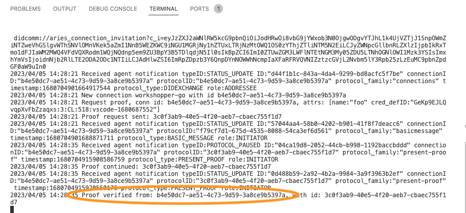

# Track 2.2 - Task 5: Verify credential

## Progress

* [Task 0: Setup environment](../README.md#task-0-setup-environment)
* [Task 1: Create a new connection](../task1/README.md#track-21---task-1-create-a-new-connection)
* [Task 2: Send greetings](../task2/README.md#track-21---task-2-send-greetings)
* [Task 3: Prepare for issuing credentials](../task3/README.md#track-21---task-3-prepare-for-issuing-credentials)
* [Task 4: Issue credential](../task4/README.md#track-21---task-4-issue-credential)
* **Task 5: Verify credential**
* [Task 6: Issue credential for verified information](../task6/README.md#track-21---task-6-issue-credential-for-verified-information)
* [Task 7: Additional tasks](../task7/README.md#track-21---task-7-additional-tasks)

## Description

Your web wallet user should now have their first credential in their wallet.
Now we can build the functionality that will verify that credential.

In a real-world implementation, we would naturally have two applications and two separate
agents, one for issuing and one for verifying. The wallet user would first acquire a credential
using the issuer application and then use the credential, i.e., prove the data,
in another application.

For simplicity, we build the verification functionality into the same application
we have been working on. The underlying protocol for requesting and presenting proofs is
[the present proof protocol](https://github.com/hyperledger/aries-rfcs/blob/main/features/0037-present-proof/README.md).

## 1. Add code for verifying logic

Create a new file `src/verify.ts`.

Add the following content to the new file:

```ts
import { agencyv1, ProtocolClient, ProtocolInfo } from '@findy-network/findy-common-ts'
import { ProtocolStatus } from '@findy-network/findy-common-ts/dist/idl/protocol_pb'

export interface Verifier {
  addInvitation: (id: string) => void
  handleNewConnection: (info: ProtocolInfo, didExchange: ProtocolStatus.DIDExchangeStatus) => Promise<void>
  handleProofPaused: (info: ProtocolInfo, presentProof: ProtocolStatus.PresentProofStatus) => void
  handleProofDone: (info: ProtocolInfo, presentProof: ProtocolStatus.PresentProofStatus) => void
}

export default (protocolClient: ProtocolClient, credDefId: string) => {
  const invitations: string[] = []

  const addInvitation = (id: string) => {
    invitations.push(id)
  }

  const handleNewConnection = async (info: ProtocolInfo, didExchange: ProtocolStatus.DIDExchangeStatus) => {
    // Skip if this connection was not for verifying
    if (!invitations.includes(info.connectionId)) {
      return
    }

    // Create proof request
    const attributes = new agencyv1.Protocol.Proof()
    const attr = new agencyv1.Protocol.Proof.Attribute()
    attr.setName("foo")
    attr.setCredDefid(credDefId)
    attributes.addAttributes(attr)

    const proofRequest = new agencyv1.Protocol.PresentProofMsg()
    proofRequest.setAttributes(attributes)

    // Send proof request to the other agent
    console.log(`Sending proof request\n${JSON.stringify(proofRequest.toObject())}\nto ${info.connectionId}`)
    await protocolClient.sendProofRequest(info.connectionId, proofRequest)
  }

  const handleProofPaused = async (info: ProtocolInfo, presentProof: ProtocolStatus.PresentProofStatus) => {
    console.log(`Proof\n${JSON.stringify(presentProof.toObject())}\nwith protocol id ${info.protocolId} paused from ${info.connectionId}`)

    // This function is called after proof is verified cryptographically.
    // The application can execute its business logic and reject the proof
    // if the attribute values are not valid.
    const protocolID = new agencyv1.ProtocolID()
    protocolID.setId(info.protocolId)
    protocolID.setTypeid(agencyv1.Protocol.Type.PRESENT_PROOF)
    protocolID.setRole(agencyv1.Protocol.Role.RESUMER)
    const msg = new agencyv1.ProtocolState()
    msg.setProtocolid(protocolID)

    // We have no special logic here - accept all received values
    msg.setState(agencyv1.ProtocolState.State.ACK)
    console.log(`Resuming proof with for protocol ${info.protocolId} with payload ${JSON.stringify(msg.toObject())}`)
    await protocolClient.resume(msg)
  }

  const handleProofDone = (info: ProtocolInfo, presentProof: ProtocolStatus.PresentProofStatus) => {
    console.log(`Proof\n${JSON.stringify(presentProof.toObject())}\nwith protocol id ${info.protocolId} verified from ${info.connectionId}`)

    // Remove invitation id from cache
    const index = invitations.indexOf(info.connectionId)
    invitations.splice(index, 1)
  }

  return {
    addInvitation,
    handleNewConnection,
    handleProofPaused,
    handleProofDone
  }
}
```

## 2. Hook verifier to agent listener

The verifier module we created in the previous step also needs the relevant agent notifications.
Add calls from the listener to the verifier to keep it updated.

Open file `src/listen.ts`.

Add the following row to imports:

```ts
import { Verifier } from './verify'
```

Add a new parameter `verifier` to the default exported function:

```ts
export default async (
  agentClient: AgentClient,
  protocolClient: ProtocolClient,
  issuer: Issuer,
  verifier: Verifier,
) => {

...

}
```

Add call to verifier's `handleNewConnection`-function whenever a new connection is established:

```ts
      // New connection is established
      DIDExchangeDone: async (info, didExchange) => {

        ...

        // Notify verifier of new connection
        verifier.handleNewConnection(info, didExchange)
      },

```

Add new handlers `PresentProofPaused` and `PresentProofDone` to the listener.
`PresentProofPaused` is called when the proof
and `PresentProofDone` to listener.
With both notifications, notify verifier:

```ts
      IssueCredentialDone: async (info, issueCredential) => {
        ...
      },

      PresentProofPaused: (info, presentProof) => {
        verifier.handleProofPaused(info, presentProof)
      },

      PresentProofDone: (info, presentProof) => {
        verifier.handleProofDone(info, presentProof)
      },
```

## 3. Implement the `/verify`-endpoint

Open file `src/index.ts`.

Add the following row to imports:

```ts
import createVerifier from './verify'
```

Modify function `runApp`.
Create the `verifier` and give it as a parameter on listener initialization:

```ts
  // Add logic for verifying
  const verifier = createVerifier(protocolClient, credDefId)

  // Start listening to agent notifications
  await listenAgent(
    agentClient,
    protocolClient,
    issuer,
    verifier
  )
```

Add implementation to the `/verify`-endpoint:

```ts
  app.get('/verify', async (req: Request, res: Response) => {
    const { id, payload } = await createInvitationPage(agentClient, 'Verify')
    // Update verifier with invitation id
    verifier.addInvitation(id)
    res.send(payload)
  });
```

## 4. Test the `/verify`-endpoint

Make sure the server is running (`npm run dev`).
Open your browser to <http://localhost:3001/verify>

*You should see a simple web page with a QR code and a text input with a prefilled string.*


## 5. Read the QR code with the web wallet

Add the connection in the same way as in [task 1](../task1/README.md#6-read-the-qr-code-with-the-web-wallet):
Tap the "Add connection" button in your web wallet and read the QR code with your mobile device. Alternatively,
you can copy-paste the invitation string to the "Add connection"-dialog.

## 6. Ensure proof request is received in the web wallet

Accept proof request.


## 7. Check server logs

Ensure that server logs display the success for the proof protocol:



## 8. Continue with task 6

Congratulations, you have completed task 6, and now know how to verify
credentials!

You can now continue with [task 6](../task6/README.md).
