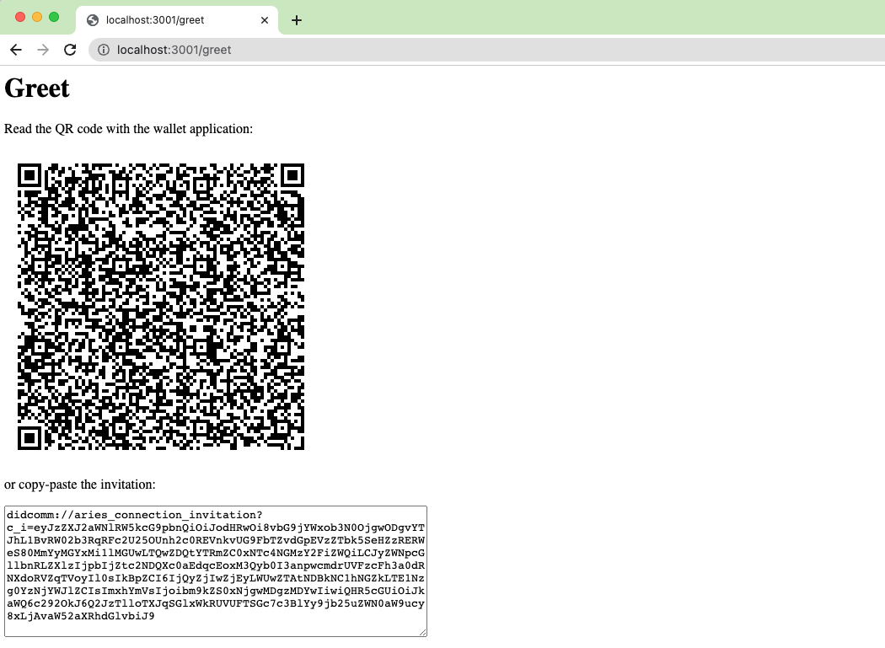
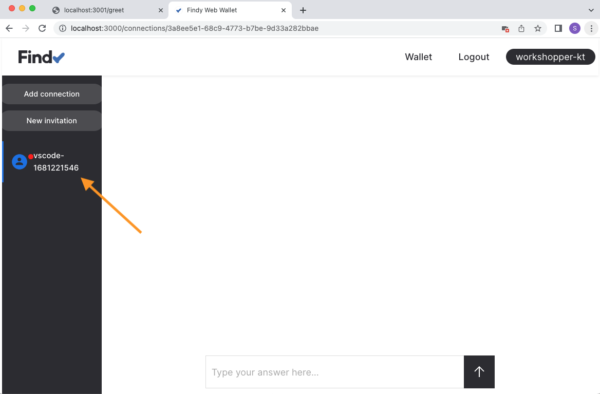
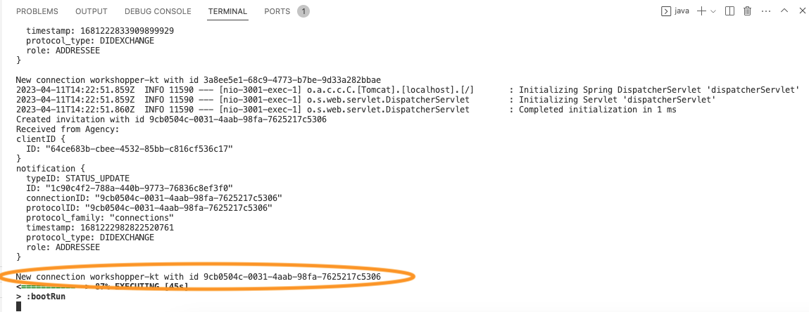

# Track 2.1 - Task 1: Create a new connection

## Progress

* [Task 0: Setup environment](../README.md#task-0-setup-environment)
* **Task 1: Create a new connection**
* [Task 2: Send greetings](../task2/README.md#track-21---task-2-send-greetings)
* [Task 3: Prepare for issuing credentials](../task3/README.md#track-21---task-3-prepare-for-issuing-credentials)
* [Task 4: Issue credential](../task4/README.md#track-21---task-4-issue-credential)
* [Task 5: Verify credential](../task5/README.md#track-21---task-5-verify-credential)
* [Task 6: Issue credential for verified information](../task6/README.md#track-21---task-6-issue-credential-for-verified-information)
* [Task 7: Additional tasks](../task7/README.md#track-21---task-7-additional-tasks)

## Description

An agent's primary capability is peer-to-peer messaging, which allows for exchanging messages
between agents. These interactions can range from simple plaintext messages to more complex tasks
such as negotiating the issuance of a credential or presenting proof. The peer-to-peer
messaging mechanism is called DIDComm, which is short for DID communication and operates based
on the exchange and use of DIDs.

Establishing a DIDComm connection requires one agent to generate an invitation and
transfer the invitation to the other agent. Typically the invitation is displayed as a QR code
that the other agent can read using a mobile device. The connection negotiation can then begin using
the information in the invitation. Eventually, the agents have a secure, e2e-encrypted
communication pipeline that they can use to transmit other protocol messages.

## 1. Add library for creating QR codes

Open file `build.gradle.kts`.

Add a new dependency to your project:

```kotlin
dependencies {
    // add library for creating QR codes
    implementation("com.google.zxing:core:3.5.1")

    implementation("org.findy_network:findy-common-kt-client:0.0.13")
    implementation("org.findy_network:findy-common-kt-stub:0.0.13")

    ...
}
```

This library will enable us to transform strings into QR codes.

Open file `src/main/kotlin/fi/oplab/findyagency/workshop/WorkshopApplication.kt`.

Add following rows to imports:

```kotlin
import kotlinx.serialization.decodeFromString
import org.findy_network.findy_common_kt.*

...

```

## 2. Create a connection invitation

Continue editing file `WorkshopApplication.kt`.

Add new declaration for data class `InvitationData`:

```kotlin
@kotlinx.serialization.Serializable data class InvitationData(
  @kotlinx.serialization.SerialName("@id") val id: String
)
```

Modify class `AppController`.
Add new functions `createInvitationPage`, `createInvitation` and `createQRCode` for
creating an HTML page with connection invitation information:

```kotlin
class AppController {
  ...

  fun createInvitationPage(header: String): Pair<String, String> {

    // Create invitation to our agent
    val invitation = createInvitation()

    // Parse invitation id
    val data = kotlinx.serialization.json.Json { ignoreUnknownKeys = true }
      .decodeFromString<InvitationData>(invitation.getJSON())
    println("Created invitation with id ${data.id}")

    val imgSrc = "data:image/png;base64," + createQRCode(invitation.url)
    val html = """<html>
    <h1>${header}</h1>
    <p>Read the QR code with the wallet application:</p>
    
    <p>or copy-paste the invitation:</p>
    <textarea onclick="this.focus();this.select()" readonly="readonly" rows="10" cols="60">${invitation.url}</textarea></html>"""

    // return both html page and invitation id
    return Pair(html, data.id)
  }

  fun createInvitation(): Invitation = kotlinx.coroutines.runBlocking {
    // Use as label whichever name we want to expose from ourselves to the other end
    agent.connection.agentClient.createInvitation(label = System.getenv("FCLI_USER"))
  }

  // Utility for converting string to QR code
  fun createQRCode(value: String): String {
    val writer = com.google.zxing.qrcode.QRCodeWriter()
    val bitMatrix = writer.encode(value, com.google.zxing.BarcodeFormat.QR_CODE, 512, 512)
    val width = bitMatrix.width
    val height = bitMatrix.height
    val bitmap = java.awt.image.BufferedImage(
      width,
      height,
      java.awt.image.BufferedImage.TYPE_USHORT_565_RGB
    )
    for (x in 0 until width) {
      for (y in 0 until height) {
        bitmap.setRGB(
          x,
          y,
          if (bitMatrix.get(x, y)) java.awt.Color.BLACK.getRGB() else java.awt.Color.WHITE.getRGB()
        )
      }
    }
    val out = java.io.ByteArrayOutputStream()
    javax.imageio.ImageIO.write(bitmap, "PNG", out)
    return java.util.Base64.getEncoder().encodeToString(out.toByteArray())
  }

...
}
```

## 3. Implement the `/greet`-endpoint

Let's add implementation to the `/greet`-endpoint.
The function should respond with an HTML page that renders a QR code for a DIDComm connection invitation.

Replace the implementation of the `/greet`-endpoint:

```kotlin
...

  @GetMapping("/greet") fun greet(): String {
    val (html) = createInvitationPage("Greet")
    return html
  }

...
```

## 4. Test the `/greet`-endpoint

Make sure the server is running (`gradle bootRun`).
Open a browser window to <http://localhost:3001/greet>

*You should see a simple web page with a QR code and a text input with a prefilled string.*



## 5. Register test user to web wallet

You should read the QR code with the web wallet to test the connection creation.
Navigate to the web wallet URL with your mobile device or open a new tab in your desktop browser.

*You can find the web wallet URL in the `.envrc`-file stored in your workspace root.
Navigate with your browser to the URL that is stored in the `FCLI_ORIGIN`-variable.*

<details>
<summary>🤠 Local setup</summary></br>

If you are using a local agency installation, you should use your desktop browser only.

</details><br/>

Pick a unique username for your web wallet user. Register and log in with your web wallet user
using your touch/face id. See the gif below if in doubt.


<details>
<summary>🤠 Authenticator emulation</summary></br>

FIDO2 authenticators can also be emulated. See [Chrome instructions](https://developer.chrome.com/docs/devtools/webauthn/)
for more information.

</details><br/>

## 6. Read the QR code with the web wallet

Tap the "Add connection" button in your web wallet and read the QR code with your mobile device. Alternatively,
copy-paste the invitation string to the input-field and click *Confirm*.


## 7. Ensure the new connection is visible in the web wallet

Check that the connections list displays the name of your client application,
and a messaging UI is visible for you.



## 8. Add agent listener

Now we have a new pairwise connection to the web wallet user that the agent negotiated for us.
However, we don't know about it, as we haven't set a listener for our agent. Let's do that next.

Open file `src/main/kotlin/fi/oplab/findyagency/workshop/Agent.kt`.

Add the following row to imports:

```kotlin
...
import kotlinx.coroutines.launch
...
```

Declare new interface for the agent listeners:

```kotlin
interface Listener {
  suspend fun handleNewConnection(
    notification: Notification,
    status: ProtocolStatus.DIDExchangeStatus
  ) {}
}
```

Add new a new function `listen` to the class `agent`
that will listen for the agent events and notify registered listeners:

```kotlin
class Agent {

  ...

  fun listen(listeners: List<Listener>) {
    kotlinx.coroutines.GlobalScope.launch {
      connection.agentClient.listen().collect {
        println("Received from Agency:\n$it")
        val status = it.notification
        when (status.typeID) {
          Notification.Type.STATUS_UPDATE -> {
            // info contains the protocol related information
            val info = connection.protocolClient.status(status.protocolID)
            val getType =
                fun(): Protocol.Type =
                    if (info.state.state == ProtocolState.State.OK) status.protocolType
                    else Protocol.Type.NONE

            when (getType()) {
              // New connection established
              Protocol.Type.DIDEXCHANGE -> {
                listeners.map{ it.handleNewConnection(status, info.didExchange) }
              }
              else -> println("no handler for protocol type: ${status.protocolType}")
            }
          }
          else -> println("no handler for notification type: ${status.typeID}")
        }
      }
    }
  }

  ...
}

```

Add a new file `src/main/kotlin/fi/oplab/findyagency/workshop/Greeter.kt`.

This module will handle our greeting functionality: for now,
we just print the name of the other agent to logs.
Add the following content to the new file:

```kotlin
package fi.oplab.findyagency.workshop

import org.findy_network.findy_common_kt.*

class Greeter(connection: Connection) : Listener {
  val connection = connection

  override suspend fun handleNewConnection(
    notification: Notification,
    status: ProtocolStatus.DIDExchangeStatus
  ) {
    println("New connection ${status.theirLabel} with id ${notification.connectionID}")
  }
}
```

Next, we will modify `AppController`-class to start the listening.
We will create instance of `Greeter` and add it to the listener array.

Open file `WorkshopApplication.kt`.
Add new member `greeter` to `AppController` class and start
listening in constructor:

```kotlin
@RestController
class AppController {
  val agent = Agent()
  val greeter = Greeter(agent.connection)

  init {
    val listeners = ArrayList<Listener>()
    listeners.add(greeter)
    // Start listening to agent notifications 
    agent.listen(listeners)
  }

  ...

}
```

## 9. Check the name of the web wallet user

Restart the server, refresh the `/greet`-page and create a new connection using the web wallet UI.

Check that the server logs print out the web wallet user name.



## 10. Continue with task 2

Congratulations, you have completed task 1, and you know now how to establish DIDComm connections
between agents for message exchange!

You can now continue with [task 2](../task2/README.md).
