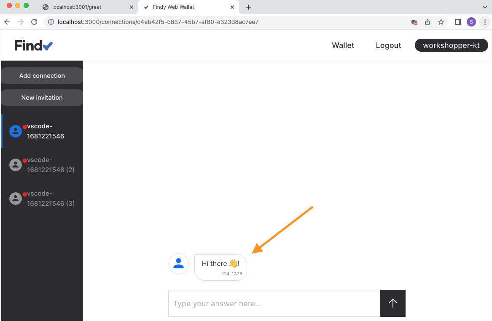
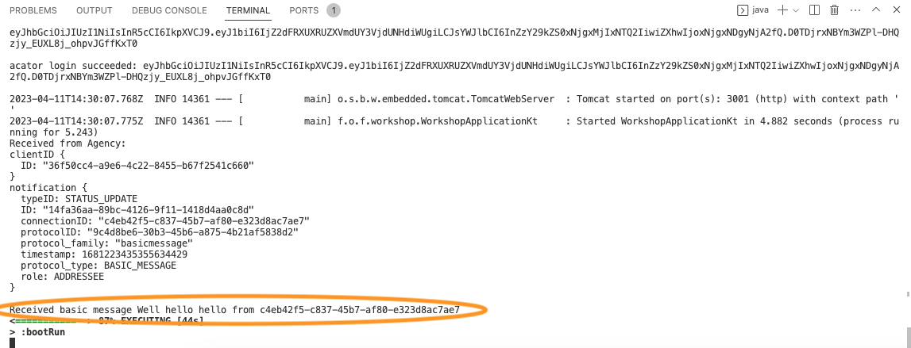

# Track 2.1 - Task 2: Send greetings

## Progress

* [Task 0: Setup environment](../README.md#task-0-setup-environment)
* [Task 1: Create a new connection](../task1/README.md#track-21---task-1-create-a-new-connection)
* **Task 2: Send greetings**
* [Task 3: Prepare for issuing credentials](../task3/README.md#track-21---task-3-prepare-for-issuing-credentials)
* [Task 4: Issue credential](../task4/README.md#track-21---task-4-issue-credential)
* [Task 5: Verify credential](../task5/README.md#track-21---task-5-verify-credential)
* [Task 6: Issue credential for verified information](../task6/README.md#track-21---task-6-issue-credential-for-verified-information)
* [Task 7: Additional tasks](../task7/README.md#track-21---task-7-additional-tasks)

## Description

In the previous task, we learned how to establish e2e-encrypted messaging pipes between agents. Now
we send our first messages using this communication pipe.

Agents interact using Hyperledger Aries protocols. There are different protocols for different purposes.
Agents send text messages to each other using
[basic message protocol](https://github.com/hyperledger/aries-rfcs/blob/main/features/0095-basic-message/README.md).

## 1. Use protocol API client to send a text to the other agent

In the previous task, we added a handler for new connection notifications.
Modify this handler so that when a new connection gets created, we send a greeting
to the other agent.

Open file `Greeter.kt`.

Modify handler `handleNewConnection` to following:

```kotlin
  override suspend fun handleNewConnection(
    notification: Notification,
    status: ProtocolStatus.DIDExchangeStatus
  ) {
    println("New connection ${status.theirLabel} with id ${notification.connectionID}")

    // Greet each new connection with basic message
    connection.protocolClient.sendMessage(
      notification.connectionID,
      "Hi there 👋!"
    )
  }
```

## 2. Ensure the message is sent to the web wallet

Refresh the `/greet`-page and create a new connection using the web wallet UI.
Check that the greeting is received in the web wallet UI.



## 3. Add handler for received messages

Open file `Agent.kt`.

Add new method `handleBasicMesssageDone` to `Listener` interface:

```kotlin
interface Listener {
  suspend fun handleNewConnection(
    notification: Notification,
    status: ProtocolStatus.DIDExchangeStatus
  ) {}

  // Send notification to listener when basic message protocol is completed
  suspend fun handleBasicMessageDone(
    notification: Notification,
    status: ProtocolStatus.BasicMessageStatus
  ) {}
}
```

When receiving messages from other agents, notify listeners via the new method.
Edit `listen`-function:

```kotlin

  ...

  fun listen(listeners: List<Listener>) {

  ...

        when (status.typeID) {
          Notification.Type.STATUS_UPDATE -> {

            ...

            when (getType()) {
              Protocol.Type.DIDEXCHANGE -> {
                listeners.map{ it.handleNewConnection(status, info.didExchange) }
              }
              // Notify basic message protocol events
              Protocol.Type.BASIC_MESSAGE -> {
                listeners.map{ it.handleBasicMessageDone(status, info.basicMessage) }
              }
              else -> println("no handler for protocol type: ${status.protocolType}")
            }
          }
          ...
        }
      }

  ...

  }
```

Open file `Greeter.kt`.
Handle basic messages in `Greeter` implementation. Add new function `handleBasicMesssageDone`
and print messages to log:

```kotlin
  override suspend fun handleBasicMessageDone(
    notification: Notification,
    status: ProtocolStatus.BasicMessageStatus
  ) {

    if (!status.sentByMe) {
      println("Received basic message ${status.content} from ${notification.connectionID}")
    }
  }
```

## 4. Ensure the received message is printed to logs

Send a reply from the web wallet UI:


Check that the sent message is visible in the server logs:



## 5. Continue with task 3

Congratulations, you have completed task 2, and now know how to send and receive
basic messages with the Hyperledger Aries protocol!

You can now continue with [task 3](../task3/README.md).
