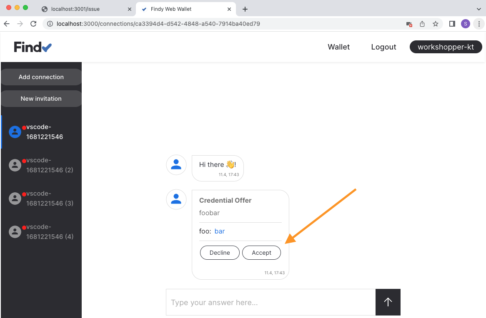
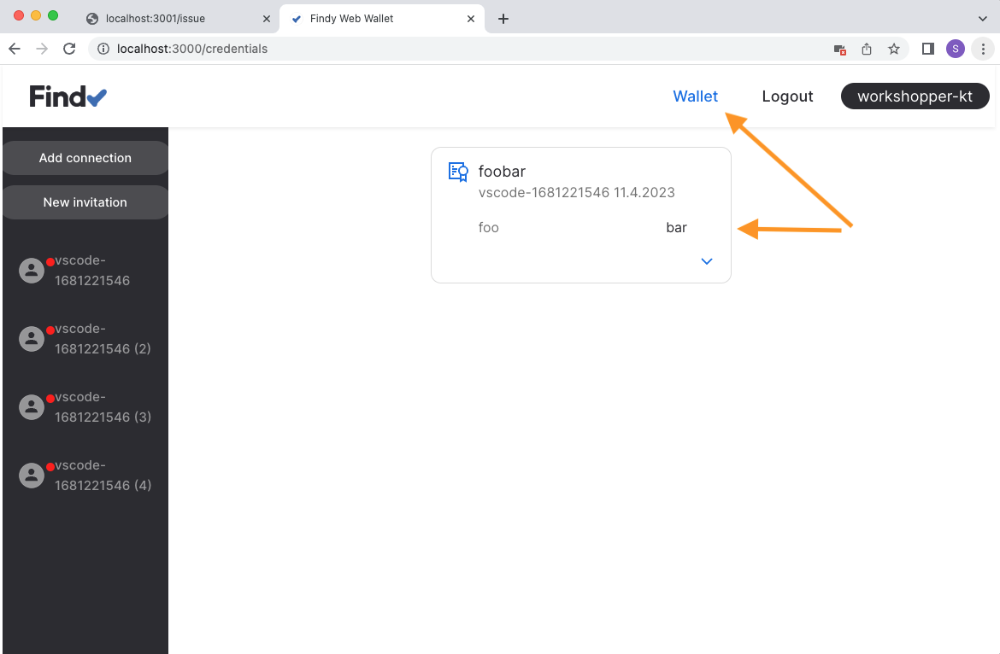

# Track 2.1 - Task 4: Issue credential

## Progress

* [Task 0: Setup environment](../README.md#task-0-setup-environment)
* [Task 1: Create a new connection](../task1/README.md#track-21---task-1-create-a-new-connection)
* [Task 2: Send greetings](../task2/README.md#track-21---task-2-send-greetings)
* [Task 3: Prepare for issuing credentials](../task3/README.md#track-21---task-3-prepare-for-issuing-credentials)
* **Task 4: Issue credential**
* [Task 5: Verify credential](../task5/README.md#track-21---task-5-verify-credential)
* [Task 6: Issue credential for verified information](../task6/README.md#track-21---task-6-issue-credential-for-verified-information)
* [Task 7: Additional tasks](../task7/README.md#track-21---task-7-additional-tasks)

## Description

Now that we have completed setting up the basic bells and whistles, we can start the real fun
with issuing and verifying credentials.

First, let's issue a dummy credential to the web wallet user and verify it afterward.
In a real-world application, the issuer would naturally know something about the user
and issue a credential only with validated information. But for this case,
we issue a dummy credential to all users connecting with us.

Agents use [the issue credential protocol](https://github.com/hyperledger/aries-rfcs/blob/main/features/0036-issue-credential/README.md)
when handling the issuing process. Luckily, Findy Agency handles the execution of this complex
protocol for us (similarly to other Hyperledger Aries protocols).

### Task sequence

In this task:

We will create a new connection according to [the steps in task 1](../task1/README.md#task-sequence).
We have already the logic for that in place.
In addition, we will add logic to the application to issue credentials:

1. Once the connection protocol is complete, the application is notified of the new connection.
1. Application sends a credential offer to the new connection.
1. Application agent initiates the Aries issue credential protocol.
1. Wallet user gets a notification of the offer.
1. Wallet user accepts the offer.
1. Issue credential protocol continues.
1. Once the protocol is completed, the application is notified of the issuing success.
1. Once the protocol is completed, the wallet user is notified of the received credential.

```mermaid
sequenceDiagram
    autonumber
    participant Client Application
    participant Application Agent
    participant User Agent
    actor Wallet User

    Note left of Wallet User: User reads QR-code from /issue-page
    Application Agent->>Client Application: <<New connection!>>
    Client Application->>Application Agent: Send credential offer
    Note right of Application Agent: Aries Issue credential protocol
    Application Agent->>User Agent: Send offer
    User Agent->>Wallet User: <<Offer received!>>
    Wallet User->>User Agent: Accept
    User Agent->>Application Agent: <<Protocol continues>
    Application Agent->>Client Application: <<Credential issued!>>
    User Agent->>Wallet User: <<Credential received!>>
```

## 1. Add code for issuing logic

Open file `Agent.kt`.
Add new method `handleIssueCredentialDone` to listener interface:

```kotlin
interface Listener {

  ...

  // Send notification to listener when issue credential protocol is completed
  suspend fun handleIssueCredentialDone(
    notification: Notification,
    status: ProtocolStatus.IssueCredentialStatus
  ) {}
}

```

When receiving notification for the issue credential protocol, notify listeners via the new method.
Edit `listen`-function:

```kotlin

  ...

  fun listen(listeners: List<Listener>) {

  ...

        when (status.typeID) {
          Notification.Type.STATUS_UPDATE -> {

            ...

            when (getType()) {
              ...

              // Notify issue credential protocol events
              Protocol.Type.ISSUE_CREDENTIAL -> {
                listeners.map{ it.handleIssueCredentialDone(status, info.issueCredential) }
              }

              else -> println("no handler for protocol type: ${status.protocolType}")
            }
          }
          ...
        }
      }

  ...

  }
```

## 2. Add code for issuing logic

Create a new file `src/main/kotlin/fi/oplab/findyagency/workshop/Issuer.kt`.

Add the following content to the new file:

```kotlin
package fi.oplab.findyagency.workshop

import org.findy_network.findy_common_kt.*

class Pairwise(id: String) {
  val id: String = id
}

class Issuer(
  connection: Connection,
  credDefId: String
) : Listener {
  val connection = connection
  val pwConnections: MutableMap<String, Pairwise> =
    java.util.Collections.synchronizedMap(mutableMapOf<String, Pairwise>())
  val credDefId: String = credDefId

  fun addInvitation(id: String) {
    pwConnections.put(id, Pairwise(id = id))
  }

  override suspend fun handleNewConnection(
    notification: Notification,
    status: ProtocolStatus.DIDExchangeStatus
  ) {
    if (!pwConnections.contains(notification.connectionID)) {
      // Connection was not for issuing, skip
      return
    }

    val attrs = mapOf("foo" to "bar")

    println("Offer credential, conn id: ${notification.connectionID}, credDefID: ${credDefId}, attrs: ${attrs}")

    // Send credential offer to the other agent
    connection.protocolClient.sendCredentialOffer(
      notification.connectionID,
      attrs,
      credDefId
    )
  }

  override suspend fun handleIssueCredentialDone(
    notification: Notification,
    status: ProtocolStatus.IssueCredentialStatus
  ) {
    println("Credential issued, conn id: ${notification.connectionID} with id ${notification.protocolID}")

    pwConnections.remove(notification.connectionID)
  }
}

```

## 3. Implement the `/issue`-endpoint

Open file `WorkshopApplication.kt`.

Create new member `issuer` and add it to the listeners list:

```kotlin
@RestController
class AppController {
  val agent = Agent()
  val greeter = Greeter(agent.connection)
  // Create issuer instance
  val issuer = Issuer(agent.connection, agent.credDefId)

  init {
    val listeners = ArrayList<Listener>()
    listeners.add(greeter)
    // Add issuer to the listener array
    listeners.add(issuer)
    agent.listen(listeners)
  }

  ...

}

```

Replace the implementation in the `/issue`-endpoint with the following:

```kotlin
  // Show pairwise invitation. Once connection is established, issue credential.
  @GetMapping("/issue") fun issue(): String {
    val (html, id) = createInvitationPage("Issue")
    issuer.addInvitation(id)
    return html
  }
```

## 4. Test the `/issue`-endpoint

Make sure the server is running (`gradle bootRun`).
Open your browser to <http://localhost:3001/issue>

*You should see a simple web page with a QR code and a text input with a prefilled string.*


## 5. Read the QR code with the web wallet

Add the connection in the same way as in [task 1](../task1/README.md#6-read-the-qr-code-with-the-web-wallet):
Tap the "Add connection" button in your web wallet and read the QR code with your mobile device. Alternatively,
you can copy-paste the invitation string to the "Add connection"-dialog.

## 6. Ensure the credential offer is received in the web wallet

Accept the credential offer.



Check the wallet view that the credential is stored there.



## 7. Check the server logs

Ensure that server logs display the success for the issue protocol:


## 8. Continue with task 5

Congratulations, you have completed task 4, and know now how to issue
credentials!
To revisit what happened, check [the sequence diagram](#task-sequence).

You can now continue with [task 5](../task5/README.md).
