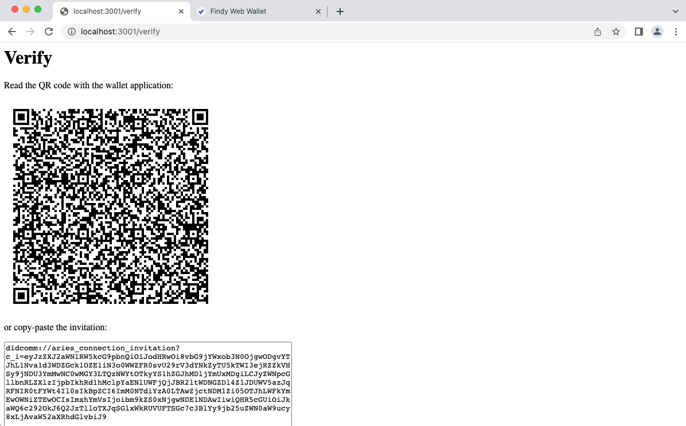
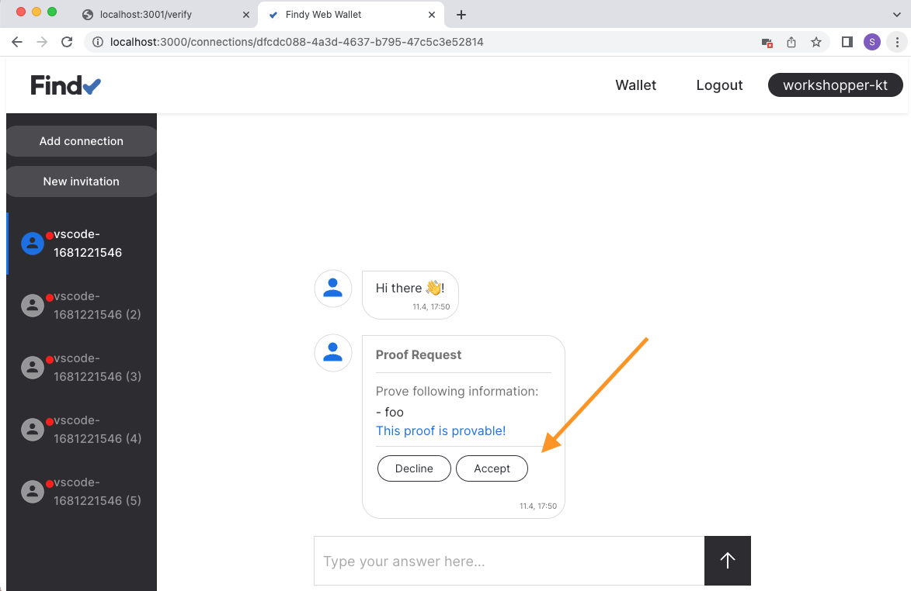
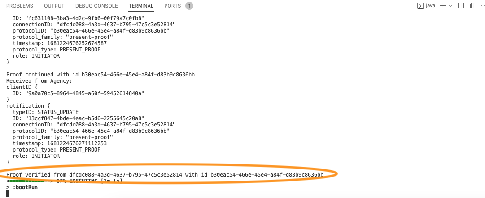

# Track 2.1 - Task 5: Verify credential

## Progress

* [Task 0: Setup environment](../README.md#task-0-setup-environment)
* [Task 1: Create a new connection](../task1/README.md#track-21---task-1-create-a-new-connection)
* [Task 2: Send greetings](../task2/README.md#track-21---task-2-send-greetings)
* [Task 3: Prepare for issuing credentials](../task3/README.md#track-21---task-3-prepare-for-issuing-credentials)
* [Task 4: Issue credential](../task4/README.md#track-21---task-4-issue-credential)
* **Task 5: Verify credential**
* [Task 6: Issue credential for verified information](../task6/README.md#track-21---task-6-issue-credential-for-verified-information)
* [Task 7: Additional tasks](../task7/README.md#track-21---task-7-additional-tasks)

## Description

Your web wallet user should now have their first credential in their wallet.
Now we can build the functionality that will verify that credential.

In a real-world implementation, we would naturally have two applications and two separate
agents, one for issuing and one for verifying. The wallet user would first acquire a credential
using the issuer application and then use the credential, i.e., prove the data,
in another application.

For simplicity, we build the verification functionality into the same application
we have been working on. The underlying protocol for requesting and presenting proofs is
[the present proof protocol](https://github.com/hyperledger/aries-rfcs/blob/main/features/0037-present-proof/README.md).

### Task sequence

In this task:

We will create a new connection according to [the steps in task 1](../task1/README.md#task-sequence).
We have already the logic for that in place.
In addition, we will add logic to the application to verify credentials:

1. Once the connection protocol is complete, the application is notified of the new connection.
1. Application sends a proof request to the new connection.
1. Application agent initiates the Aries present proof protocol.
1. Wallet user gets a notification of the request.
1. Wallet user accepts the request.
1. Present proof protocol continues.
1. The application gets a notification of the presentation.
1. The application approves the proof presentation.
1. Present proof protocol continues.
1. Once the protocol is completed, the wallet user is notified that proving was successful.
1. Once the protocol is completed, the application is notified that verifying was successful.

```mermaid
sequenceDiagram
    autonumber
    participant Client Application
    participant Application Agent
    participant User Agent
    actor Wallet User

    Note left of Wallet User: User reads QR-code from /verify-page
    Application Agent->>Client Application: <<New connection!>>
    Client Application->>Application Agent: Send proof request
    Note right of Application Agent: Aries Present proof protocol
    Application Agent->>User Agent: Send request
    User Agent->>Wallet User: <<Request received!>>
    Wallet User->>User Agent: Accept request
    User Agent->>Application Agent: <<Protocol continues>
    Application Agent->>Client Application: <<Presentation received!>>
    Client Application->>Application Agent: Approve presentation
    Application Agent->>User Agent: <<Protocol continues>
    User Agent->>Wallet User: <<Proof ok!>>
    Application Agent->>Client Application: <<Proof ok!>>
```

## 1. Listen to present proof protocol

Open file `Agent.kt`.
Add new methods `handlePresentProofPaused` and `handlePresentProofDone` to listener interface:

```kotlin
interface Listener {
  ...

  // Send notification to listener when present proof protocol is paused
  suspend fun handlePresentProofPaused(
    notification: Notification,
    status: ProtocolStatus.PresentProofStatus
  ) {}

  // Send notification to listener when present proof protocol is completed
  suspend fun handlePresentProofDone(
    notification: Notification,
    status: ProtocolStatus.PresentProofStatus
  ) {}
}
```

When receiving notification for the present proof protocol, notify listeners via the new methods.
Replace the implementation of `listen`-function with the following:

```kotlin
  fun listen(listeners: List<Listener>) {
    kotlinx.coroutines.GlobalScope.launch {
      connection.agentClient.listen().collect {
        println("Received from Agency:\n$it")
        val status = it.notification
        when (status.typeID) {
          Notification.Type.STATUS_UPDATE -> {
            // info contains the protocol related information
            val info = connection.protocolClient.status(status.protocolID)
            val getType =
                fun(): Protocol.Type =
                    if (info.state.state == ProtocolState.State.OK) status.protocolType
                    else Protocol.Type.NONE

            when (getType()) {
              // New connection established
              Protocol.Type.DIDEXCHANGE -> {
                listeners.map{ it.handleNewConnection(status, info.didExchange) }
              }
              // Notify basic message protocol events
              Protocol.Type.BASIC_MESSAGE -> {
                listeners.map{ it.handleBasicMessageDone(status, info.basicMessage) }
              }
              // Notify issue credential protocol events
              Protocol.Type.ISSUE_CREDENTIAL -> {
                listeners.map{ it.handleIssueCredentialDone(status, info.issueCredential) }
              }
              // Notify listener when present proof protocol is completed
              Protocol.Type.PRESENT_PROOF -> {
                listeners.map{ it.handlePresentProofDone(status, info.presentProof) }
              }
              else -> println("no handler for protocol type: ${status.protocolType}")
            }
          }
          // Notify listener when present proof protocol is paused
          Notification.Type.PROTOCOL_PAUSED -> {
            val info = connection.protocolClient.status(status.protocolID)
            listeners.map{ it.handlePresentProofPaused(status, info.presentProof) }
          }
          else -> println("no handler for notification type: ${status.typeID}")
        }
      }
    }
  }
```

## 2. Add code for verifying logic

Create a new file `src/main/kotlin/fi/oplab/findyagency/workshop/Verifier.kt`.

Add the following content to the new file:

```kotlin
package fi.oplab.findyagency.workshop

import org.findy_network.findy_common_kt.*

class Verifier(
  connection: Connection,
  credDefId: String
) : Listener {
  val connection = connection
  val pwConnections: MutableMap<String, Pairwise> =
    java.util.Collections.synchronizedMap(mutableMapOf<String, Pairwise>())
  val credDefId: String = credDefId

  fun addInvitation(id: String) {
    pwConnections.put(id, Pairwise(id = id))
  }

  override suspend fun handleNewConnection(
    notification: Notification,
    status: ProtocolStatus.DIDExchangeStatus
  ) {
    if (!pwConnections.contains(notification.connectionID)) {
      // Connection was not for verifying, skip
      return
    }

    val attrs = listOf(ProofRequestAttribute("foo", credDefId))

    println("Request proof, conn id: ${notification.connectionID}, credDefID: ${credDefId}, attrs: ${attrs}")

    // Send credential offer to the other agent
    connection.protocolClient.sendProofRequest(
        notification.connectionID,
        attrs,
    )
  }

  // This function is called after proof is verified cryptographically.
  // The application can execute its business logic and reject the proof
  // if the attribute values are not valid.
  override suspend fun handlePresentProofPaused(
    notification: Notification,
    status: ProtocolStatus.PresentProofStatus
  ) {
    // we have no special logic here - accept all received values
    connection.protocolClient.resumeProofRequest(notification.protocolID, true)
    println("Proof continued with id ${notification.protocolID}")
  }

  override suspend fun handlePresentProofDone(
    notification: Notification,
    status: ProtocolStatus.PresentProofStatus
  ) {
    if (!pwConnections.contains(notification.connectionID)) {
      // Connection was not for verifying, skip
      return
    }
    println("Proof verified from ${notification.connectionID} with id ${notification.protocolID}")

    pwConnections.remove(notification.connectionID)
  }
}

```

## 3. Implement the `/verify`-endpoint

Open file `WorkshopApplication.kt`.

Create new member `verifier` and add it to the listeners list:

```kotlin
@RestController
class AppController {
  val agent = Agent()
  val greeter = Greeter(agent.connection)
  val issuer = Issuer(agent.connection, agent.credDefId)
  val verifier = Verifier(agent.connection, agent.credDefId)

  init {
    val listeners = ArrayList<Listener>()
    listeners.add(greeter)
    listeners.add(issuer)
    listeners.add(verifier)
    agent.listen(listeners)
  }
  ...

}

```

Replace the implementation in the `/verify`-endpoint with the following:

```kotlin
  @GetMapping("/verify") fun verify(): String {
    val (html, id) = createInvitationPage("Verify")
    verifier.addInvitation(id)
    return html
  }
```

## 4. Test the `/verify`-endpoint

Make sure the server is restarted (`gradle bootRun`).
Open your browser to <http://localhost:3001/verify>

*You should see a simple web page with a QR code and a text input with a prefilled string.*



## 5. Read the QR code with the web wallet

Add the connection in the same way as in [task 1](../task1/README.md#6-read-the-qr-code-with-the-web-wallet):
Tap the "Add connection" button in your web wallet and read the QR code with your mobile device. Alternatively,
you can copy-paste the invitation string to the "Add connection"-dialog.

## 6. Ensure proof request is received in the web wallet

Accept proof request.



## 7. Check server logs

Ensure that server logs display the success for the proof protocol:



## 8. Continue with task 6

Congratulations, you have completed task 5, and now know how to verify
credentials!
To revisit what happened, check [the sequence diagram](#task-sequence).

You can now continue with [task 6](../task6/README.md).
